Forecast product sales
================
Gianluca Crocivera
7/11/2019

### Load packages

``` r
library(ggplot2)
library(dplyr)
```

### Load data

``` r
sales_data_sample=read.csv('sales_data_sample.csv', sep=',',header=TRUE) 
```

### Data

It is important to be able to forecast sales accurately in order to
allocate the right quantities of products in the store in advance. On
the one hand, if you had too many products in the store, inventory
management would not be efficient. A lot of money would be wasted
putting the products on the shelves, which will not be bought. On the
other hand, if the demand is underestimated would be worse, because the
turnover would be negatively influenced by not having sold the products
that could have been sold.

The problem is that product sales generally vary over time. There are
times when customers buy less and others when they buy more. Sales can
rise to one thousand units in one month and go down in another. It is
possible to improve one’s forecasting capacity. We can therefore
estimate in R, what the effect of the month will be as an explanatory
variable, using a simple regression in which sales would be the
dependent variable. It is noted that the adjusted R square is always
above 60% so it is a good model.

In addition, a boxplot allows you to view the distribution of sales
month by month.

In any case, you can view the differences between the months and see
which months report great sales, and which months report minor sales.
With the simple regression model, sales can be optimized while reducing
the cost of inventory management.

It should be noted that in the winter months, especially in November,
customers buy more and it is in those months that the products in the
store must be increased:

``` r
for (p in levels(sales_data_sample$PRODUCTLINE)) {
 
  df <- sales_data_sample  %>%
  filter(!is.na(MONTH_ID) & PRODUCTLINE==p) %>%
  mutate(MONTH_ID=factor(MONTH_ID)) %>%  
  group_by(YEAR_ID,MONTH_ID) %>%
  summarise(tot_quantity=sum(QUANTITYORDERED))

regres=lm(tot_quantity~ MONTH_ID,data=df) 


p1<- df %>%
  ggplot(aes(MONTH_ID,tot_quantity)) +
  geom_boxplot() +
  ggtitle(p)

df1<- data_frame(month=1:nrow(df),tot_quantity=df$tot_quantity)
df2<- data_frame(month=1:nrow(df),tot_quantity=regres$fitted.values)

p2<- ggplot(df1,aes(month,tot_quantity)) +
  geom_line(aes(color="Actual Sales")) +
  geom_line(data=df2,aes(color="Sales by the model")) +
    labs(color="Legend Text") +
  ggtitle(paste(p," sales over the time"))

print(p)
print(summary(regres))
print("______________________________________________________________")
print(p1)
print(p2)

}
```

    ## Warning: `data_frame()` is deprecated, use `tibble()`.
    ## This warning is displayed once per session.

    ## [1] "Classic Cars"
    ## 
    ## Call:
    ## lm(formula = tot_quantity ~ MONTH_ID, data = df)
    ## 
    ## Residuals:
    ##     Min      1Q  Median      3Q     Max 
    ## -773.00 -172.33   62.67  202.00  773.00 
    ## 
    ## Coefficients:
    ##             Estimate Std. Error t value Pr(>|t|)    
    ## (Intercept)   913.33     263.61   3.465  0.00296 ** 
    ## MONTH_ID2     -51.33     372.80  -0.138  0.89210    
    ## MONTH_ID3     -94.00     372.80  -0.252  0.80395    
    ## MONTH_ID4    -143.33     372.80  -0.384  0.70539    
    ## MONTH_ID5     105.67     372.80   0.283  0.78026    
    ## MONTH_ID6    -373.33     416.80  -0.896  0.38291    
    ## MONTH_ID7     100.67     416.80   0.242  0.81204    
    ## MONTH_ID8     198.67     416.80   0.477  0.63968    
    ## MONTH_ID9      55.67     416.80   0.134  0.89532    
    ## MONTH_ID10    995.67     416.80   2.389  0.02877 *  
    ## MONTH_ID11   2860.67     416.80   6.863 2.75e-06 ***
    ## MONTH_ID12    189.17     416.80   0.454  0.65567    
    ## ---
    ## Signif. codes:  0 '***' 0.001 '**' 0.01 '*' 0.05 '.' 0.1 ' ' 1
    ## 
    ## Residual standard error: 456.6 on 17 degrees of freedom
    ## Multiple R-squared:  0.8274, Adjusted R-squared:  0.7158 
    ## F-statistic:  7.41 on 11 and 17 DF,  p-value: 0.0001537
    ## 
    ## [1] "______________________________________________________________"

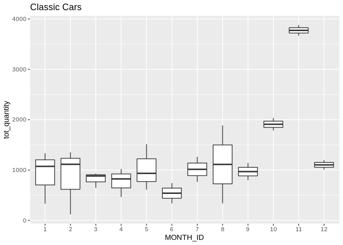<!-- -->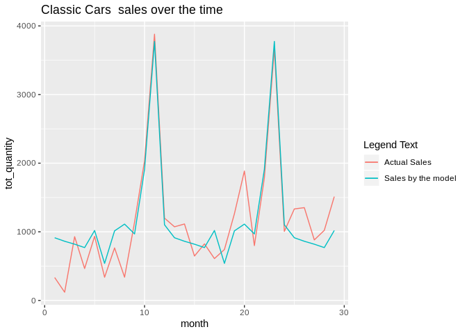<!-- -->

    ## [1] "Motorcycles"
    ## 
    ## Call:
    ## lm(formula = tot_quantity ~ MONTH_ID, data = df)
    ## 
    ## Residuals:
    ##    Min     1Q Median     3Q    Max 
    ## -235.0 -108.8  -15.0  112.2  235.0 
    ## 
    ## Coefficients:
    ##             Estimate Std. Error t value Pr(>|t|)    
    ## (Intercept)   418.50     127.03   3.295 0.004914 ** 
    ## MONTH_ID2     -34.83     163.99  -0.212 0.834648    
    ## MONTH_ID3     -77.00     179.64  -0.429 0.674289    
    ## MONTH_ID4     -34.50     163.99  -0.210 0.836206    
    ## MONTH_ID5     -67.50     163.99  -0.412 0.686451    
    ## MONTH_ID6    -160.50     179.64  -0.893 0.385737    
    ## MONTH_ID7    -107.50     179.64  -0.598 0.558499    
    ## MONTH_ID8     139.00     179.64   0.774 0.451102    
    ## MONTH_ID9    -180.00     179.64  -1.002 0.332245    
    ## MONTH_ID10    108.50     179.64   0.604 0.554889    
    ## MONTH_ID11    842.00     179.64   4.687 0.000292 ***
    ## MONTH_ID12   -177.50     179.64  -0.988 0.338794    
    ## ---
    ## Signif. codes:  0 '***' 0.001 '**' 0.01 '*' 0.05 '.' 0.1 ' ' 1
    ## 
    ## Residual standard error: 179.6 on 15 degrees of freedom
    ## Multiple R-squared:  0.7794, Adjusted R-squared:  0.6176 
    ## F-statistic: 4.818 on 11 and 15 DF,  p-value: 0.002958
    ## 
    ## [1] "______________________________________________________________"

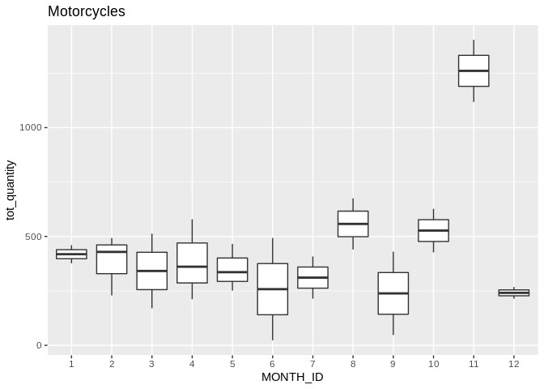<!-- -->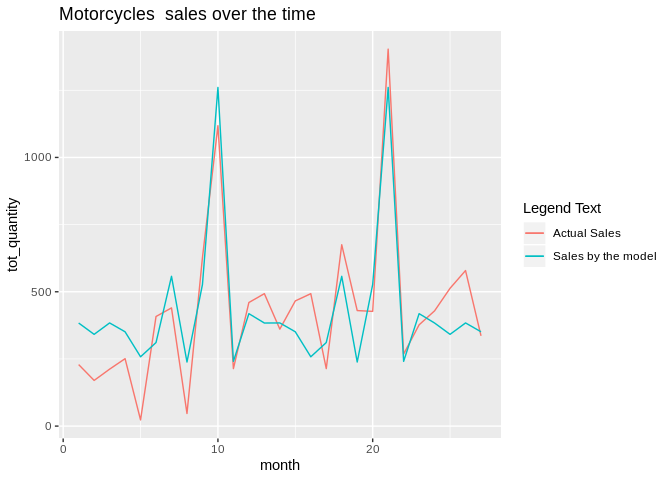<!-- -->

    ## [1] "Planes"
    ## 
    ## Call:
    ## lm(formula = tot_quantity ~ MONTH_ID, data = df)
    ## 
    ## Residuals:
    ##     Min      1Q  Median      3Q     Max 
    ## -376.00  -67.58    0.00   57.33  376.00 
    ## 
    ## Coefficients:
    ##             Estimate Std. Error t value Pr(>|t|)  
    ## (Intercept)   294.00     163.89   1.794   0.1003  
    ## MONTH_ID2      90.67     211.58   0.429   0.6765  
    ## MONTH_ID3     589.00     283.87   2.075   0.0622 .
    ## MONTH_ID4      96.33     211.58   0.455   0.6577  
    ## MONTH_ID5     109.50     231.78   0.472   0.6458  
    ## MONTH_ID6     103.50     231.78   0.447   0.6639  
    ## MONTH_ID7     140.00     283.87   0.493   0.6316  
    ## MONTH_ID8      83.50     231.78   0.360   0.7255  
    ## MONTH_ID9      66.00     283.87   0.233   0.8204  
    ## MONTH_ID10    263.50     231.78   1.137   0.2798  
    ## MONTH_ID11    655.00     231.78   2.826   0.0165 *
    ## MONTH_ID12     89.50     231.78   0.386   0.7068  
    ## ---
    ## Signif. codes:  0 '***' 0.001 '**' 0.01 '*' 0.05 '.' 0.1 ' ' 1
    ## 
    ## Residual standard error: 231.8 on 11 degrees of freedom
    ## Multiple R-squared:  0.5788, Adjusted R-squared:  0.1577 
    ## F-statistic: 1.374 on 11 and 11 DF,  p-value: 0.3035
    ## 
    ## [1] "______________________________________________________________"

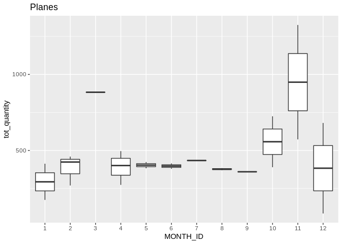<!-- -->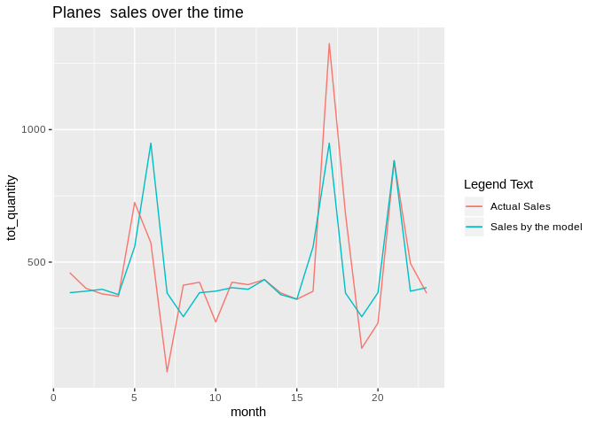<!-- -->

    ## [1] "Ships"
    ## 
    ## Call:
    ## lm(formula = tot_quantity ~ MONTH_ID, data = df)
    ## 
    ## Residuals:
    ##     Min      1Q  Median      3Q     Max 
    ## -150.50  -19.25    0.00   38.25  150.50 
    ## 
    ## Coefficients:
    ##             Estimate Std. Error t value Pr(>|t|)    
    ## (Intercept)   326.00      75.92   4.294 0.001269 ** 
    ## MONTH_ID2     -85.33      98.01  -0.871 0.402564    
    ## MONTH_ID3      68.50     107.37   0.638 0.536541    
    ## MONTH_ID4    -126.50     107.37  -1.178 0.263588    
    ## MONTH_ID5     -22.00     107.37  -0.205 0.841393    
    ## MONTH_ID6     -19.50     107.37  -0.182 0.859188    
    ## MONTH_ID7     -59.00     131.50  -0.449 0.662382    
    ## MONTH_ID8     -11.50     107.37  -0.107 0.916633    
    ## MONTH_ID9     -66.00     107.37  -0.615 0.551258    
    ## MONTH_ID10    152.50     107.37   1.420 0.183231    
    ## MONTH_ID11    508.00     107.37   4.731 0.000618 ***
    ## MONTH_ID12    -23.00     131.50  -0.175 0.864333    
    ## ---
    ## Signif. codes:  0 '***' 0.001 '**' 0.01 '*' 0.05 '.' 0.1 ' ' 1
    ## 
    ## Residual standard error: 107.4 on 11 degrees of freedom
    ## Multiple R-squared:  0.831,  Adjusted R-squared:  0.6619 
    ## F-statistic: 4.916 on 11 and 11 DF,  p-value: 0.006859
    ## 
    ## [1] "______________________________________________________________"

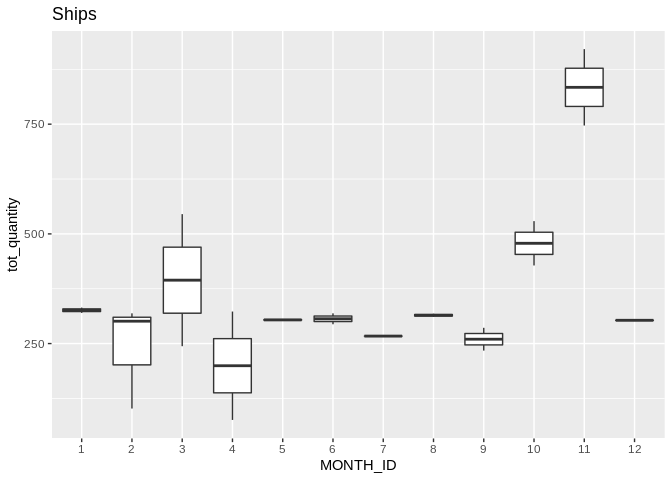<!-- -->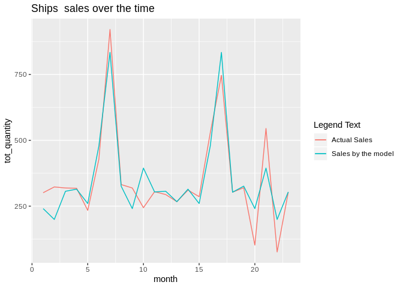<!-- -->

    ## [1] "Trains"
    ## 
    ## Call:
    ## lm(formula = tot_quantity ~ MONTH_ID, data = df)
    ## 
    ## Residuals:
    ##    Min     1Q Median     3Q    Max 
    ## -71.50  -3.25   0.00   3.25  71.50 
    ## 
    ## Coefficients:
    ##             Estimate Std. Error t value Pr(>|t|)   
    ## (Intercept)   79.333     26.672   2.974  0.01265 * 
    ## MONTH_ID2     -6.333     37.720  -0.168  0.86971   
    ## MONTH_ID3     38.667     42.172   0.917  0.37887   
    ## MONTH_ID4    -10.333     53.344  -0.194  0.84993   
    ## MONTH_ID5     47.667     42.172   1.130  0.28240   
    ## MONTH_ID6     36.667     53.344   0.687  0.50609   
    ## MONTH_ID7     55.667     53.344   1.044  0.31909   
    ## MONTH_ID8     28.167     42.172   0.668  0.51797   
    ## MONTH_ID9     11.167     42.172   0.265  0.79607   
    ## MONTH_ID10    94.667     42.172   2.245  0.04631 * 
    ## MONTH_ID11   169.167     42.172   4.011  0.00205 **
    ## MONTH_ID12    22.667     42.172   0.537  0.60164   
    ## ---
    ## Signif. codes:  0 '***' 0.001 '**' 0.01 '*' 0.05 '.' 0.1 ' ' 1
    ## 
    ## Residual standard error: 46.2 on 11 degrees of freedom
    ## Multiple R-squared:  0.7046, Adjusted R-squared:  0.4092 
    ## F-statistic: 2.385 on 11 and 11 DF,  p-value: 0.08251
    ## 
    ## [1] "______________________________________________________________"

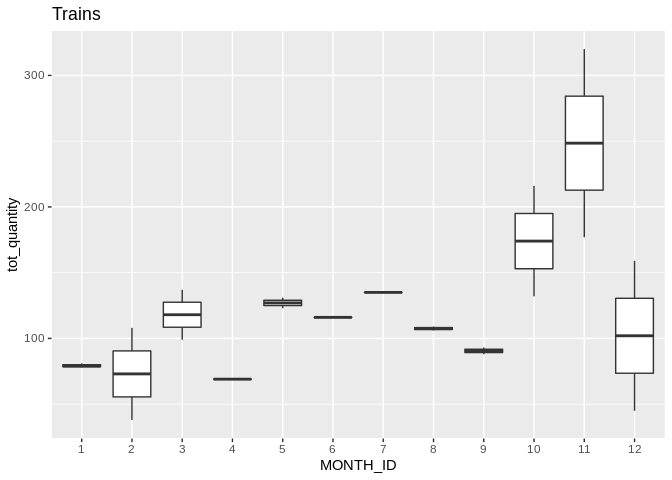<!-- -->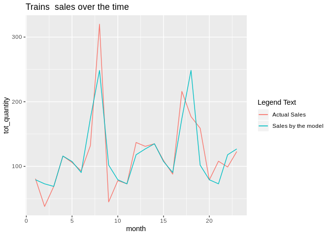<!-- -->

    ## [1] "Trucks and Buses"
    ## 
    ## Call:
    ## lm(formula = tot_quantity ~ MONTH_ID, data = df)
    ## 
    ## Residuals:
    ##     Min      1Q  Median      3Q     Max 
    ## -229.67 -103.88   -1.25   91.25  354.33 
    ## 
    ## Coefficients:
    ##             Estimate Std. Error t value Pr(>|t|)    
    ## (Intercept)   251.00     100.85   2.489   0.0260 *  
    ## MONTH_ID2      89.00     159.46   0.558   0.5856    
    ## MONTH_ID3     -39.33     142.62  -0.276   0.7867    
    ## MONTH_ID4      28.00     201.70   0.139   0.8916    
    ## MONTH_ID5     226.67     142.62   1.589   0.1343    
    ## MONTH_ID6      36.00     159.46   0.226   0.8246    
    ## MONTH_ID7      67.50     159.46   0.423   0.6785    
    ## MONTH_ID8      -7.50     159.46  -0.047   0.9632    
    ## MONTH_ID9     161.50     159.46   1.013   0.3283    
    ## MONTH_ID10    352.00     159.46   2.207   0.0445 *  
    ## MONTH_ID11    894.00     159.46   5.606 6.47e-05 ***
    ## MONTH_ID12    238.00     159.46   1.493   0.1577    
    ## ---
    ## Signif. codes:  0 '***' 0.001 '**' 0.01 '*' 0.05 '.' 0.1 ' ' 1
    ## 
    ## Residual standard error: 174.7 on 14 degrees of freedom
    ## Multiple R-squared:  0.7788, Adjusted R-squared:  0.605 
    ## F-statistic: 4.481 on 11 and 14 DF,  p-value: 0.005145
    ## 
    ## [1] "______________________________________________________________"

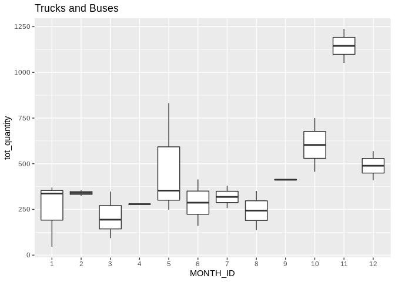<!-- -->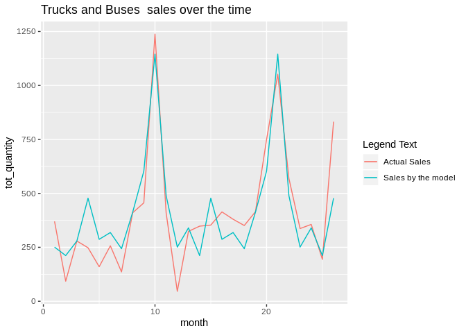<!-- -->

    ## [1] "Vintage Cars"
    ## 
    ## Call:
    ## lm(formula = tot_quantity ~ MONTH_ID, data = df)
    ## 
    ## Residuals:
    ##      Min       1Q   Median       3Q      Max 
    ## -292.500 -141.000   -9.333  113.333  312.333 
    ## 
    ## Coefficients:
    ##             Estimate Std. Error t value Pr(>|t|)    
    ## (Intercept)   729.67     122.41   5.961 1.55e-05 ***
    ## MONTH_ID2    -266.00     173.11  -1.537   0.1428    
    ## MONTH_ID3     -96.00     173.11  -0.555   0.5864    
    ## MONTH_ID4    -288.33     173.11  -1.666   0.1141    
    ## MONTH_ID5    -136.33     173.11  -0.788   0.4418    
    ## MONTH_ID6    -266.67     193.54  -1.378   0.1861    
    ## MONTH_ID7    -341.67     193.54  -1.765   0.0955 .  
    ## MONTH_ID8    -173.17     193.54  -0.895   0.3834    
    ## MONTH_ID9     -39.67     193.54  -0.205   0.8400    
    ## MONTH_ID10    520.33     193.54   2.689   0.0155 *  
    ## MONTH_ID11   1487.83     193.54   7.687 6.25e-07 ***
    ## MONTH_ID12    -52.67     193.54  -0.272   0.7888    
    ## ---
    ## Signif. codes:  0 '***' 0.001 '**' 0.01 '*' 0.05 '.' 0.1 ' ' 1
    ## 
    ## Residual standard error: 212 on 17 degrees of freedom
    ## Multiple R-squared:  0.8863, Adjusted R-squared:  0.8128 
    ## F-statistic: 12.05 on 11 and 17 DF,  p-value: 5.792e-06
    ## 
    ## [1] "______________________________________________________________"

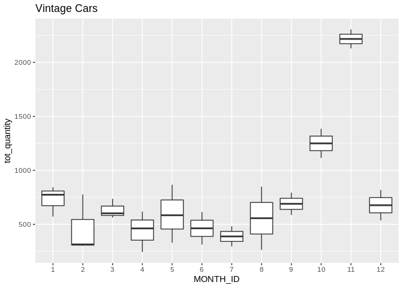<!-- -->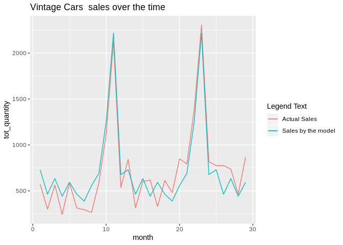<!-- -->

### Prediction

``` r
df <- sales_data_sample  %>%
  filter(!is.na(MONTH_ID) & PRODUCTLINE=="Vintage Cars") %>%
  mutate(MONTH_ID=factor(MONTH_ID)) %>%  
  group_by(YEAR_ID,MONTH_ID) %>%
  summarise(tot_quantity=sum(QUANTITYORDERED))

final_model=lm(tot_quantity~ MONTH_ID,data=df) 

for (m in levels(df$MONTH_ID)) {
      new_product <- data.frame( MONTH_ID=m)
      pred <-predict(final_model, new_product, interval = "confidence", level = 0.95)
      print("______________________________________________________________")
      print("Product : Vintage Cars") 
      print(paste("Month: ",m))
      print(paste("The predict total quantity is ",round(pred[1],2), "."))
      print("We are 95% confident that total quantity will be") 
      print(paste("between ",round(pred[2],2), " and " , round(pred[3],2) ,"" ))
  }
```

    ## [1] "______________________________________________________________"
    ## [1] "Product : Vintage Cars"
    ## [1] "Month:  1"
    ## [1] "The predict total quantity is  729.67 ."
    ## [1] "We are 95% confident that total quantity will be"
    ## [1] "between  471.41  and  987.92 "
    ## [1] "______________________________________________________________"
    ## [1] "Product : Vintage Cars"
    ## [1] "Month:  2"
    ## [1] "The predict total quantity is  463.67 ."
    ## [1] "We are 95% confident that total quantity will be"
    ## [1] "between  205.41  and  721.92 "
    ## [1] "______________________________________________________________"
    ## [1] "Product : Vintage Cars"
    ## [1] "Month:  3"
    ## [1] "The predict total quantity is  633.67 ."
    ## [1] "We are 95% confident that total quantity will be"
    ## [1] "between  375.41  and  891.92 "
    ## [1] "______________________________________________________________"
    ## [1] "Product : Vintage Cars"
    ## [1] "Month:  4"
    ## [1] "The predict total quantity is  441.33 ."
    ## [1] "We are 95% confident that total quantity will be"
    ## [1] "between  183.08  and  699.59 "
    ## [1] "______________________________________________________________"
    ## [1] "Product : Vintage Cars"
    ## [1] "Month:  5"
    ## [1] "The predict total quantity is  593.33 ."
    ## [1] "We are 95% confident that total quantity will be"
    ## [1] "between  335.08  and  851.59 "
    ## [1] "______________________________________________________________"
    ## [1] "Product : Vintage Cars"
    ## [1] "Month:  6"
    ## [1] "The predict total quantity is  463 ."
    ## [1] "We are 95% confident that total quantity will be"
    ## [1] "between  146.71  and  779.29 "
    ## [1] "______________________________________________________________"
    ## [1] "Product : Vintage Cars"
    ## [1] "Month:  7"
    ## [1] "The predict total quantity is  388 ."
    ## [1] "We are 95% confident that total quantity will be"
    ## [1] "between  71.71  and  704.29 "
    ## [1] "______________________________________________________________"
    ## [1] "Product : Vintage Cars"
    ## [1] "Month:  8"
    ## [1] "The predict total quantity is  556.5 ."
    ## [1] "We are 95% confident that total quantity will be"
    ## [1] "between  240.21  and  872.79 "
    ## [1] "______________________________________________________________"
    ## [1] "Product : Vintage Cars"
    ## [1] "Month:  9"
    ## [1] "The predict total quantity is  690 ."
    ## [1] "We are 95% confident that total quantity will be"
    ## [1] "between  373.71  and  1006.29 "
    ## [1] "______________________________________________________________"
    ## [1] "Product : Vintage Cars"
    ## [1] "Month:  10"
    ## [1] "The predict total quantity is  1250 ."
    ## [1] "We are 95% confident that total quantity will be"
    ## [1] "between  933.71  and  1566.29 "
    ## [1] "______________________________________________________________"
    ## [1] "Product : Vintage Cars"
    ## [1] "Month:  11"
    ## [1] "The predict total quantity is  2217.5 ."
    ## [1] "We are 95% confident that total quantity will be"
    ## [1] "between  1901.21  and  2533.79 "
    ## [1] "______________________________________________________________"
    ## [1] "Product : Vintage Cars"
    ## [1] "Month:  12"
    ## [1] "The predict total quantity is  677 ."
    ## [1] "We are 95% confident that total quantity will be"
    ## [1] "between  360.71  and  993.29 "
