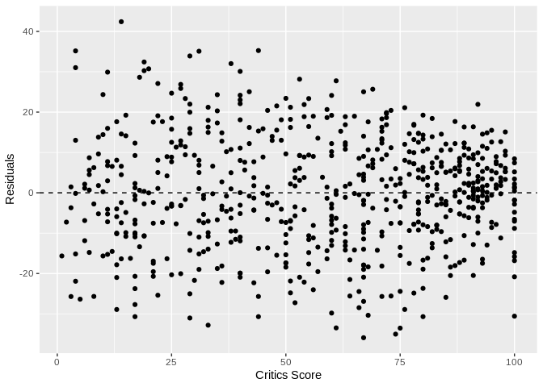

Modeling and prediction for movies
================
Gianluca Crocivera
7/6/2019

## Setup

### Load packages

``` r
library(ggplot2)
library(dplyr)
library(statsr)
library(scales)
library(stringr)
```

### Load data

``` r
load("movies.Rdata")
```

## Part 1: Data

The data set `movies` is comprised of 651 randomly sampled movies
produced and released before 2016. This dataset includes information
from Rotten Tomatoes (the most trusted measurements of quality for
movies & TV) and IMDB (the most popular and authorative source for
movie, TV, and celebrity) for a random sample of movies.The movies in
the sample are independent (simple random sample consists of 651
observations, fewer than 10% of the all movies) so the results can be
generalized to all movies. We have movies on 32 different variables,
some categorical and some numerical. The analysis is observational and
not experimental and no random assignment was used, therefore causality
relationships cannot be established between the variables .

``` r
#The first 20 movies by audience score on Rotten Tomatoes

movies %>%
  arrange(desc(audience_score)) %>%
  select(title,genre,director,critics_score,audience_score) %>%
  top_n(20,audience_score)
```

    ## # A tibble: 20 x 5
    ##    title              genre        director    critics_score audience_score
    ##    <chr>              <fct>        <chr>               <dbl>          <dbl>
    ##  1 The Godfather, Pa… Mystery & S… Francis Fo…            97             97
    ##  2 Promises           Documentary  B.Z. Goldb…            96             96
    ##  3 The Five Heartbea… Musical & P… Robert Tow…            38             95
    ##  4 In the Name of th… Drama        Jim Sherid…            94             95
    ##  5 Aliens             Action & Ad… James Came…            98             94
    ##  6 The Color Purple   Drama        Steven Spi…            88             94
    ##  7 Memento            Mystery & S… Christophe…            92             94
    ##  8 Good Will Hunting  Drama        Gus Van Sa…            97             94
    ##  9 Teenage Paparazzo  Documentary  Adrian Gre…           100             94
    ## 10 Annie Hall         Comedy       Woody Allen            98             93
    ## 11 My Flesh and Blood Documentary  Jonathan K…            90             93
    ## 12 Glory              Drama        Edward Zwi…            93             93
    ## 13 Trainspotting      Drama        Danny Boyle            89             93
    ## 14 The Wood           Drama        Rick Famuy…            61             92
    ## 15 Warrior            Drama        Gavin O'Co…            82             92
    ## 16 Orwell Rolls in H… Documentary  Robert Kan…            79             92
    ## 17 Aladdin            Action & Ad… John Musker            94             92
    ## 18 Cameraman: The Li… Documentary  Craig McCa…            96             92
    ## 19 The Prestige       Drama        Christophe…            76             92
    ## 20 Pete Seeger: The … Documentary  Jim Brown              95             92

## Part 2: Research question

What is the relation between the genre’s choice of a movie by the Studio
that produced the movie and audience score, while keeping the other
variables constant, such as critics score, runtime of movie (in
minutes), whether or not the movie was nominated for a best picture
Oscar, etc. ?

The variables chosen are:

<ul>

<li>

**audience\_score**: Audience score on Rotten Tomatoes (predicted
variable)

</li>

<li>

**genre**:Genre of movie (predictor variable)

</li>

<li>

**runtime**: Runtime of movie in minutes (predictor variable)

</li>

<li>

**critics\_score**: Critics score on Rotten Tomatoes (predictor
variable)

</li>

<li>

**best\_pic\_nom**:Whether or not the movie was nominated for a best
picture Oscar (predictor variable)

</li>

<li>

**best\_pic\_win**: Whether or not the movie won a best picture Oscar
(predictor variable)

</li>

<li>

**best\_actor\_win**: Whether or not one of the main actors in the movie
ever won an Oscar (predictor variable)

</li>

<li>

**best\_actress\_win**: Whether or not one of the main actresses in the
movie ever won an Oscar (predictor variable)

</li>

<li>

**best\_dir\_win**: Whether or not the director of the movie ever won an
Oscar (predictor variable)

</li>

</ul>

## Part 3: Exploratory data analysis

We will first start with analyzing genre. In the sample the percentage
of drama movies is greater than others. From highest genre percentage to
lowest genre percentage we have: Drama, Action & Adventure, Mystery &
Suspense , Documentary, Horror, Other, Art House & International,
Musical & Performing Arts, Animation, Science Fiction & Fantasy.

``` r
movies %>% 
  mutate(genre=factor(genre, 
levels = c('Drama','Action & Adventure','Mystery & Suspense',
           'Documentary','Horror','Other','Art House & International',
           'Musical & Performing Arts','Animation',
           'Science Fiction & Fantasy'))) %>%
  filter(!is.na(genre)) %>% 
  ggplot(aes(genre,fill=genre)) + 
  geom_bar(aes(y=(..count../sum(..count..))))+
  theme(axis.text.x = element_text(angle = 90, hjust = 1))+
  scale_y_continuous(labels = percent_format())+
  ylab("Percent of movies") +
  xlab("Genre") +
  ggtitle("Percentage of movies in the sample by genre")
```

<!-- -->

Next, we consider the movies’s possible relationship between audience
score on Rotten Tomatoes and genre.

``` r
movies %>%
  group_by(genre) %>%
  summarise(
    mean=mean(audience_score),
    median=median(audience_score),
    range=range(audience_score)[2]-range(audience_score)[1],
    IQR(audience_score)) %>%
  arrange(desc(mean)) 
```

    ## # A tibble: 11 x 5
    ##    genre                      mean median range `IQR(audience_score)`
    ##    <fct>                     <dbl>  <dbl> <dbl>                 <dbl>
    ##  1 Documentary                82.8   86      39                  12.8
    ##  2 Musical & Performing Arts  80.2   80.5    40                  13.8
    ##  3 Other                      66.7   73.5    70                  29.5
    ##  4 Drama                      65.3   70      82                  28  
    ##  5 Art House & International  64     65.5    57                  29  
    ##  6 Animation                  62.4   65      70                  11  
    ##  7 Mystery & Suspense         55.9   54      82                  30  
    ##  8 Action & Adventure         53.8   52      83                  28  
    ##  9 Comedy                     52.5   50      74                  30.5
    ## 10 Science Fiction & Fantasy  50.9   47      68                  53  
    ## 11 Horror                     45.8   43      60                  17.5

``` r
movies %>% 
  filter(!is.na(genre),!is.na(audience_score)) %>% 
  mutate(genre = reorder(genre,audience_score)) %>%
  ggplot(aes(genre,audience_score)) + 
  geom_boxplot()+
  ylab("Audience Score") +
  xlab("Genre")+
  coord_flip()
```

<!-- -->

The audience score on Rotten Tomatoes in the sample for movies genre
does not reflect the percentage of movies in the sample by genre. From
highest to lowest we have another order of preference: Documentary,
Musical & Performing Arts, Other, Drama, Art House & International etc.

Next, we consider the movies’ possible relationship between rating on
IMDB and genre.

``` r
movies %>%
  group_by(genre) %>%
  summarise(mean=mean(imdb_rating),
            median=median(imdb_rating),
            range=range(imdb_rating)[2]-range(imdb_rating)[1],
            IQR(imdb_rating)) %>%
  arrange(desc(mean)) 
```

    ## # A tibble: 11 x 5
    ##    genre                      mean median range `IQR(imdb_rating)`
    ##    <fct>                     <dbl>  <dbl> <dbl>              <dbl>
    ##  1 Documentary                7.65   7.6   1.9               0.5  
    ##  2 Musical & Performing Arts  7.3    7.55  2.2               0.775
    ##  3 Drama                      6.67   6.8   5.8               1.2  
    ##  4 Other                      6.63   6.8   4.7               0.925
    ##  5 Art House & International  6.61   6.5   3.2               1.17 
    ##  6 Mystery & Suspense         6.48   6.5   4.8               1.000
    ##  7 Action & Adventure         5.97   6     6.1               1.1  
    ##  8 Animation                  5.9    6.4   4.8               1.4  
    ##  9 Horror                     5.76   5.9   4                 0.7  
    ## 10 Science Fiction & Fantasy  5.76   5.9   4.6               2.4  
    ## 11 Comedy                     5.74   5.7   6.20              1.4

``` r
movies %>% 
  filter(!is.na(genre),!is.na(imdb_rating)) %>% 
  mutate(genre = reorder(genre,imdb_rating)) %>%
  ggplot(aes(genre,imdb_rating)) + 
  geom_boxplot()+
  ylab("IMDB rating") +
  xlab("Genre")+
  coord_flip()
```

<!-- -->

Also in this case the IMDB rating for movies genre does not reflect the
percentage of movies in the sample by genre. From highest to lowest we
have another order of preference: Documentary, Musical & Performing
Arts, Drama, Other, Art House & International etc. But the preference
order for IMDB is very similar to that of Rotten Tomatoes.

## Part 4: Modeling

If audience\_score (Audience score on Rotten Tomatoes) is predicted
variable, I look for a model that allows me to know from which
predictors variables it depends. For model selection I choose backwards
elimination: start with a full model (containing all predictors), drop
one predictor at a time and record adjusted R square of each smaller
model, pick the model with the highest increase in adjusted R square.
Repeat until none of the models yield an increase in the adjusted R
square. R square tells us what percent of variability in the response
variable is explained by the model. Adjusted R square applies a penalty
for the number of predictors included in the
model.

``` r
var_ex <- c('genre','runtime','critics_score','best_pic_nom','best_pic_win','best_actor_win','best_actress_win','best_dir_win')

for (i in 1:7) {

  dict <- c()
    
  for (e in var_ex) {
      var_temp <- var_ex[!var_ex==e]
  f <- paste ( 'audience_score' ,paste(var_temp, collapse = ' + ' ), sep = '~')
      m <- lm( f , data = movies)
      dict[e] <- summary(m)$adj.r.squared
  }
  print("________________________________________________")
  print(dict[which.max(dict)])
  var_ex <-var_ex[!var_ex==names(which.max(dict))]

}
```

    ## [1] "________________________________________________"
    ## best_dir_win 
    ##    0.5280301 
    ## [1] "________________________________________________"
    ## best_pic_win 
    ##    0.5287301 
    ## [1] "________________________________________________"
    ## best_actor_win 
    ##      0.5287463 
    ## [1] "________________________________________________"
    ## best_actress_win 
    ##         0.528337 
    ## [1] "________________________________________________"
    ##   runtime 
    ## 0.5265887 
    ## [1] "________________________________________________"
    ## best_pic_nom 
    ##    0.5196506 
    ## [1] "________________________________________________"
    ##     genre 
    ## 0.4952284

**From the model we need to delete best\_dir\_win, best\_pic\_win,
best\_actor\_win to get an adjusted R square= 0.5287463 then adjusted R
square starts to decrease.**

Next drop the variable with the highest p-value and refit a smaller
model repeat until all variables left in the model are
significant.

``` r
m_best = lm(audience_score ~ genre + runtime + critics_score + best_pic_nom  + best_actress_win , data = movies)
summary(m_best)
```

    ## 
    ## Call:
    ## lm(formula = audience_score ~ genre + runtime + critics_score + 
    ##     best_pic_nom + best_actress_win, data = movies)
    ## 
    ## Residuals:
    ##     Min      1Q  Median      3Q     Max 
    ## -35.498  -9.310   0.551   9.289  41.352 
    ## 
    ## Coefficients:
    ##                                Estimate Std. Error t value Pr(>|t|)    
    ## (Intercept)                    29.17308    3.70312   7.878 1.45e-14 ***
    ## genreAnimation                  6.06235    4.98043   1.217 0.223968    
    ## genreArt House & International  5.98558    4.10178   1.459 0.144987    
    ## genreComedy                    -0.50511    2.29810  -0.220 0.826102    
    ## genreDocumentary                9.85007    2.79853   3.520 0.000463 ***
    ## genreDrama                      1.81989    1.96828   0.925 0.355520    
    ## genreHorror                    -8.35275    3.39092  -2.463 0.014032 *  
    ## genreMusical & Performing Arts 10.26484    4.43744   2.313 0.021028 *  
    ## genreMystery & Suspense        -4.10073    2.53260  -1.619 0.105905    
    ## genreOther                      1.24587    3.92266   0.318 0.750886    
    ## genreScience Fiction & Fantasy -6.49455    4.94510  -1.313 0.189546    
    ## runtime                         0.06146    0.03129   1.964 0.049920 *  
    ## critics_score                   0.44005    0.02194  20.059  < 2e-16 ***
    ## best_pic_nomyes                 9.36084    3.22615   2.902 0.003842 ** 
    ## best_actress_winyes            -2.27080    1.82251  -1.246 0.213235    
    ## ---
    ## Signif. codes:  0 '***' 0.001 '**' 0.01 '*' 0.05 '.' 0.1 ' ' 1
    ## 
    ## Residual standard error: 13.89 on 635 degrees of freedom
    ##   (1 observation deleted due to missingness)
    ## Multiple R-squared:  0.5389, Adjusted R-squared:  0.5287 
    ## F-statistic: 53.01 on 14 and 635 DF,  p-value: < 2.2e-16

``` r
m_best2 = lm(audience_score ~ genre + runtime + critics_score + best_pic_nom, data = movies)
summary(m_best2)
```

    ## 
    ## Call:
    ## lm(formula = audience_score ~ genre + runtime + critics_score + 
    ##     best_pic_nom, data = movies)
    ## 
    ## Residuals:
    ##     Min      1Q  Median      3Q     Max 
    ## -35.636  -9.437   0.505   9.068  41.431 
    ## 
    ## Coefficients:
    ##                                Estimate Std. Error t value Pr(>|t|)    
    ## (Intercept)                    29.73777    3.67688   8.088 3.08e-15 ***
    ## genreAnimation                  5.72179    4.97508   1.150 0.250539    
    ## genreArt House & International  5.81573    4.10129   1.418 0.156673    
    ## genreComedy                    -0.77027    2.28922  -0.336 0.736622    
    ## genreDocumentary                9.77182    2.79904   3.491 0.000514 ***
    ## genreDrama                      1.53573    1.95587   0.785 0.432634    
    ## genreHorror                    -8.41533    3.39202  -2.481 0.013362 *  
    ## genreMusical & Performing Arts 10.32291    4.43912   2.325 0.020362 *  
    ## genreMystery & Suspense        -4.42960    2.51990  -1.758 0.079254 .  
    ## genreOther                      1.07846    3.92206   0.275 0.783426    
    ## genreScience Fiction & Fantasy -6.50856    4.94723  -1.316 0.188784    
    ## runtime                         0.05607    0.03100   1.809 0.070966 .  
    ## critics_score                   0.43993    0.02195  20.045  < 2e-16 ***
    ## best_pic_nomyes                 8.77152    3.19268   2.747 0.006177 ** 
    ## ---
    ## Signif. codes:  0 '***' 0.001 '**' 0.01 '*' 0.05 '.' 0.1 ' ' 1
    ## 
    ## Residual standard error: 13.9 on 636 degrees of freedom
    ##   (1 observation deleted due to missingness)
    ## Multiple R-squared:  0.5378, Adjusted R-squared:  0.5283 
    ## F-statistic: 56.92 on 13 and 636 DF,  p-value: < 2.2e-16

``` r
final_model = lm(audience_score ~ genre +  critics_score + best_pic_nom, data = movies)
summary(final_model)
```

    ## 
    ## Call:
    ## lm(formula = audience_score ~ genre + critics_score + best_pic_nom, 
    ##     data = movies)
    ## 
    ## Residuals:
    ##     Min      1Q  Median      3Q     Max 
    ## -35.912  -9.413   0.263   9.303  42.404 
    ## 
    ## Coefficients:
    ##                                Estimate Std. Error t value Pr(>|t|)    
    ## (Intercept)                    35.37484    1.94874  18.153  < 2e-16 ***
    ## genreAnimation                  4.75334    4.95247   0.960  0.33752    
    ## genreArt House & International  5.67764    4.10574   1.383  0.16719    
    ## genreComedy                    -1.16710    2.28154  -0.512  0.60915    
    ## genreDocumentary                9.00721    2.76845   3.254  0.00120 ** 
    ## genreDrama                      1.76581    1.95409   0.904  0.36652    
    ## genreHorror                    -9.08085    3.37626  -2.690  0.00734 ** 
    ## genreMusical & Performing Arts 10.72496    4.43899   2.416  0.01597 *  
    ## genreMystery & Suspense        -4.17514    2.51908  -1.657  0.09793 .  
    ## genreOther                      1.23054    3.92605   0.313  0.75406    
    ## genreScience Fiction & Fantasy -6.70347    4.95228  -1.354  0.17634    
    ## critics_score                   0.44435    0.02184  20.342  < 2e-16 ***
    ## best_pic_nomyes                10.03913    3.11827   3.219  0.00135 ** 
    ## ---
    ## Signif. codes:  0 '***' 0.001 '**' 0.01 '*' 0.05 '.' 0.1 ' ' 1
    ## 
    ## Residual standard error: 13.91 on 638 degrees of freedom
    ## Multiple R-squared:  0.5353, Adjusted R-squared:  0.5266 
    ## F-statistic: 61.25 on 12 and 638 DF,  p-value: < 2.2e-16

**The final model has as predicted variable audience\_score and as
predictors variables genre, critics\_score and best\_pic\_nom **

**Conditions for Multiple regression are** :

<ol>

<li>

linear relationships between critics\_score and audience\_score each
(numerical) explanatory variable linearly related to the response
variable check using residuals plots vs. critics\_score  
looking for a random scatter around 0

</li>

<li>

nearly normal residuals with mean 0

</li>

<li>

constant variability of residuals residuals should be equally variable
for low and high values of the predicted response variable  
check using residuals plots of residuals vs. predicted (e vs. )
residuals vs. predicted instead of residuals vs. x because it allows for
considering the entire model (with all explanatory variables) at once  
residuals randomly scattered in a band with a constant width around 0
(no fan shape)

</li>

</ol>

``` r
ggplot(data = final_model, aes(x = movies$critics_score, y = .resid)) +
  geom_point() +
  geom_hline(yintercept = 0, linetype = "dashed") +
  xlab("Critics Score") +
  ylab("Residuals")
```

<!-- -->

``` r
ggplot(data = final_model, aes(x = .resid)) +
  geom_histogram(bins= 20) +
  xlab("Residuals")
```

<!-- -->

``` r
ggplot(data = final_model, aes(sample = .resid)) +
  stat_qq()
```

<!-- -->

``` r
ggplot(data = final_model, aes(x = .fitted, y = .resid)) +
  geom_point() +
  geom_hline(yintercept = 0, linetype = "dashed") +
  xlab("Fitted values") +
  ylab("Residuals")
```

<!-- -->

**It seems like all conditions are met as well**

## Part 5: Prediction

For the movie “Prodigy” of 2019, of the genre Horror and without an
Oscar nomination, we have critics score of 45% and obtained an audience
score of 42% in Rotten Tomatoes:
<https://www.rottentomatoes.com/m/the_prodigy_2019>

The prediction with final model is :

``` r
new_movie <- data.frame(
    genre = 'Horror', critics_score = 45, best_pic_nom="no")
  predict(final_model, new_movie, interval = "confidence", level = 0.95)
```

    ##        fit      lwr      upr
    ## 1 46.28976 40.59233 51.98719

We are 95% confident that audience score will be between 40.59% and
51.98% . And in fact the predict audience score is 46.28% . The
difference between the observed value and the predicted value is only:
42-46.28=-4.28% so the final model is correct .

Suppose we want to use the final model we created earlier, `genre,
critics_score and best_pic_nom` to predict the audience score for a
movie with a critics score of 50 and the movie didnt win a best picture
Oscar and genre variabile
:

``` r
gen <- c("Musical & Performing Arts","Documentary","Art House & International","Animation","Drama","Other","Action & Adventure","Comedy","Mystery & Suspense","Science Fiction & Fantasy","Horror")
for (g in gen) {
  
  new_movie <- data.frame(
    genre = g, critics_score = 50, best_pic_nom="no")
  print("_________________________________________________________________")
  print("With a movie with a critics score of 50 and the movie  wasnt nominated for a best picture Oscar  and genre is ") 
  pred <-predict(final_model, new_movie, interval = "confidence", level = 0.95)
  print(paste( str_to_upper(g),",the predict audience score is ",round(pred[1],2), "."))
  print("We are 95% confident that audience score will be ")
  print(paste("between ",round(pred[2],2), " and " , round(pred[3],2) ,"" ))

}
```

    ## [1] "_________________________________________________________________"
    ## [1] "With a movie with a critics score of 50 and the movie  wasnt nominated for a best picture Oscar  and genre is "
    ## [1] "MUSICAL & PERFORMING ARTS ,the predict audience score is  68.32 ."
    ## [1] "We are 95% confident that audience score will be "
    ## [1] "between  60.35  and  76.29 "
    ## [1] "_________________________________________________________________"
    ## [1] "With a movie with a critics score of 50 and the movie  wasnt nominated for a best picture Oscar  and genre is "
    ## [1] "DOCUMENTARY ,the predict audience score is  66.6 ."
    ## [1] "We are 95% confident that audience score will be "
    ## [1] "between  62.5  and  70.7 "
    ## [1] "_________________________________________________________________"
    ## [1] "With a movie with a critics score of 50 and the movie  wasnt nominated for a best picture Oscar  and genre is "
    ## [1] "ART HOUSE & INTERNATIONAL ,the predict audience score is  63.27 ."
    ## [1] "We are 95% confident that audience score will be "
    ## [1] "between  55.97  and  70.57 "
    ## [1] "_________________________________________________________________"
    ## [1] "With a movie with a critics score of 50 and the movie  wasnt nominated for a best picture Oscar  and genre is "
    ## [1] "ANIMATION ,the predict audience score is  62.35 ."
    ## [1] "We are 95% confident that audience score will be "
    ## [1] "between  53.24  and  71.45 "
    ## [1] "_________________________________________________________________"
    ## [1] "With a movie with a critics score of 50 and the movie  wasnt nominated for a best picture Oscar  and genre is "
    ## [1] "DRAMA ,the predict audience score is  59.36 ."
    ## [1] "We are 95% confident that audience score will be "
    ## [1] "between  57.69  and  61.02 "
    ## [1] "_________________________________________________________________"
    ## [1] "With a movie with a critics score of 50 and the movie  wasnt nominated for a best picture Oscar  and genre is "
    ## [1] "OTHER ,the predict audience score is  58.82 ."
    ## [1] "We are 95% confident that audience score will be "
    ## [1] "between  51.93  and  65.71 "
    ## [1] "_________________________________________________________________"
    ## [1] "With a movie with a critics score of 50 and the movie  wasnt nominated for a best picture Oscar  and genre is "
    ## [1] "ACTION & ADVENTURE ,the predict audience score is  57.59 ."
    ## [1] "We are 95% confident that audience score will be "
    ## [1] "between  54.18  and  61 "
    ## [1] "_________________________________________________________________"
    ## [1] "With a movie with a critics score of 50 and the movie  wasnt nominated for a best picture Oscar  and genre is "
    ## [1] "COMEDY ,the predict audience score is  56.43 ."
    ## [1] "We are 95% confident that audience score will be "
    ## [1] "between  53.47  and  59.38 "
    ## [1] "_________________________________________________________________"
    ## [1] "With a movie with a critics score of 50 and the movie  wasnt nominated for a best picture Oscar  and genre is "
    ## [1] "MYSTERY & SUSPENSE ,the predict audience score is  53.42 ."
    ## [1] "We are 95% confident that audience score will be "
    ## [1] "between  49.85  and  56.98 "
    ## [1] "_________________________________________________________________"
    ## [1] "With a movie with a critics score of 50 and the movie  wasnt nominated for a best picture Oscar  and genre is "
    ## [1] "SCIENCE FICTION & FANTASY ,the predict audience score is  50.89 ."
    ## [1] "We are 95% confident that audience score will be "
    ## [1] "between  41.78  and  60 "
    ## [1] "_________________________________________________________________"
    ## [1] "With a movie with a critics score of 50 and the movie  wasnt nominated for a best picture Oscar  and genre is "
    ## [1] "HORROR ,the predict audience score is  48.51 ."
    ## [1] "We are 95% confident that audience score will be "
    ## [1] "between  42.81  and  54.21 "

## Part 6: Conclusion

For a film studio that can do nothing to get a positive opinion from
critics score and can do nothing to nominated movie for a best picture
Oscar, it is better to choose the following movie genres from highest to
lower::

<ol>

<li>

**“Musical & Performing Arts”**

</li>

<li>

**“Documentary”**

</li>

<li>

**“Art House & International”**

</li>

<li>

**“Animation”**

</li>

<li>

**“Drama”**

</li>

<li>

**“Other”**

</li>

<li>

**“Action & Adventure”**

</li>

<li>

**“Comedy”**

</li>

<li>

**“Mystery & Suspense”**

</li>

<li>

**“Science Fiction & Fantasy”**

</li>

<li>

**“Horror”**

</li>

</ol>
