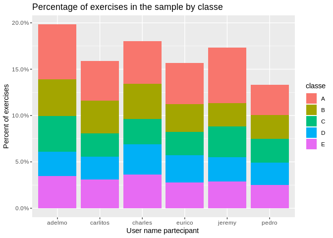

Project Report - Practical Machine Learning
================
Gianluca Crocivera
7/6/2019

### Load packages

``` r
library(ggplot2)
library(dplyr)
library(caret)
library(scales)
```

### Load data

``` r
#pml.training <- read.csv("http://groupware.les.inf.puc-rio.br/static/WLE/WearableComputing_weight_lifting_exercises_biceps_curl_variations.csv", na.strings = c(NA,"","#DIV/0!"))

#pml.training <- read.csv("https://d396qusza40orc.cloudfront.net/predmachlearn/pml-training.csv", na.strings = c(NA,"","#DIV/0!"))

pml.training <- read.csv("pml-training.csv", na.strings = c(NA,"","#DIV/0!"))
pml.testing <- read.csv("pml-testing.csv", na.strings = c(NA,"","#DIV/0!"))
```

## Part 1: Data

The data set `pml.training` is comprised of 19622 observations produced
and released from this source:
<http://groupware.les.inf.puc-rio.br/har>. We have data on 160 different
variables, some categorical and some numerical.

For data recording they use data from accelerometers on the belt,
forearm, arm, and dumbell of 6 participants. Participants were asked to
perform one set of 10 repetitions of the Unilateral Dumbbell Biceps Curl
in five different fashions: exactly according to the specification
(Class A), throwing the elbows to the front (Class B), lifting the
dumbbell only halfway (Class C), lowering the dumbbell only halfway
(Class D) and throwing the hips to the front (Class E). Class A
corresponds to the specified execution of the exercise, while the other
4 classes correspond to common mistakes. The exercises were performed by
six male participants aged between 20-28 years, with little weight
lifting experience. We made sure that all participants could easily
simulate the mistakes in a safe and controlled manner by using a
relatively light dumbbell (1.25kg).

``` r
pml.training %>%
  ggplot(aes(user_name,fill=classe)) +
  geom_bar(aes(y=(..count../sum(..count..))))+
  scale_y_continuous(labels = percent_format())+
  ylab("Percent of exercises") +
  xlab("User name partecipant ") +
  ggtitle("Percentage of exercises in the sample by classe")
```

<!-- -->

For the Euler angles of each of the four sensors they calculated eight
features: mean, variance, standard deviation, max, min, amplitude,
kurtosis and skewness, generating in total 96 derived feature sets.

These variables contain numerous missing values (NA) because they
concern a single sensor excluding the others. Also 7 variables
concerning the name of the participants, the date of execution of the
exercises, etc. are not considered in the following analysis as
predictors and therefore are excluded. These variables
    are:

``` r
colnames(pml.training)[1:7]
```

    ## [1] "X"                    "user_name"            "raw_timestamp_part_1"
    ## [4] "raw_timestamp_part_2" "cvtd_timestamp"       "new_window"          
    ## [7] "num_window"

``` r
which(colMeans(is.na(pml.training))>0.97)
```

    ##       kurtosis_roll_belt      kurtosis_picth_belt        kurtosis_yaw_belt 
    ##                       12                       13                       14 
    ##       skewness_roll_belt     skewness_roll_belt.1        skewness_yaw_belt 
    ##                       15                       16                       17 
    ##            max_roll_belt           max_picth_belt             max_yaw_belt 
    ##                       18                       19                       20 
    ##            min_roll_belt           min_pitch_belt             min_yaw_belt 
    ##                       21                       22                       23 
    ##      amplitude_roll_belt     amplitude_pitch_belt       amplitude_yaw_belt 
    ##                       24                       25                       26 
    ##     var_total_accel_belt            avg_roll_belt         stddev_roll_belt 
    ##                       27                       28                       29 
    ##            var_roll_belt           avg_pitch_belt        stddev_pitch_belt 
    ##                       30                       31                       32 
    ##           var_pitch_belt             avg_yaw_belt          stddev_yaw_belt 
    ##                       33                       34                       35 
    ##             var_yaw_belt            var_accel_arm             avg_roll_arm 
    ##                       36                       50                       51 
    ##          stddev_roll_arm             var_roll_arm            avg_pitch_arm 
    ##                       52                       53                       54 
    ##         stddev_pitch_arm            var_pitch_arm              avg_yaw_arm 
    ##                       55                       56                       57 
    ##           stddev_yaw_arm              var_yaw_arm        kurtosis_roll_arm 
    ##                       58                       59                       69 
    ##       kurtosis_picth_arm         kurtosis_yaw_arm        skewness_roll_arm 
    ##                       70                       71                       72 
    ##       skewness_pitch_arm         skewness_yaw_arm             max_roll_arm 
    ##                       73                       74                       75 
    ##            max_picth_arm              max_yaw_arm             min_roll_arm 
    ##                       76                       77                       78 
    ##            min_pitch_arm              min_yaw_arm       amplitude_roll_arm 
    ##                       79                       80                       81 
    ##      amplitude_pitch_arm        amplitude_yaw_arm   kurtosis_roll_dumbbell 
    ##                       82                       83                       87 
    ##  kurtosis_picth_dumbbell    kurtosis_yaw_dumbbell   skewness_roll_dumbbell 
    ##                       88                       89                       90 
    ##  skewness_pitch_dumbbell    skewness_yaw_dumbbell        max_roll_dumbbell 
    ##                       91                       92                       93 
    ##       max_picth_dumbbell         max_yaw_dumbbell        min_roll_dumbbell 
    ##                       94                       95                       96 
    ##       min_pitch_dumbbell         min_yaw_dumbbell  amplitude_roll_dumbbell 
    ##                       97                       98                       99 
    ## amplitude_pitch_dumbbell   amplitude_yaw_dumbbell       var_accel_dumbbell 
    ##                      100                      101                      103 
    ##        avg_roll_dumbbell     stddev_roll_dumbbell        var_roll_dumbbell 
    ##                      104                      105                      106 
    ##       avg_pitch_dumbbell    stddev_pitch_dumbbell       var_pitch_dumbbell 
    ##                      107                      108                      109 
    ##         avg_yaw_dumbbell      stddev_yaw_dumbbell         var_yaw_dumbbell 
    ##                      110                      111                      112 
    ##    kurtosis_roll_forearm   kurtosis_picth_forearm     kurtosis_yaw_forearm 
    ##                      125                      126                      127 
    ##    skewness_roll_forearm   skewness_pitch_forearm     skewness_yaw_forearm 
    ##                      128                      129                      130 
    ##         max_roll_forearm        max_picth_forearm          max_yaw_forearm 
    ##                      131                      132                      133 
    ##         min_roll_forearm        min_pitch_forearm          min_yaw_forearm 
    ##                      134                      135                      136 
    ##   amplitude_roll_forearm  amplitude_pitch_forearm    amplitude_yaw_forearm 
    ##                      137                      138                      139 
    ##        var_accel_forearm         avg_roll_forearm      stddev_roll_forearm 
    ##                      141                      142                      143 
    ##         var_roll_forearm        avg_pitch_forearm     stddev_pitch_forearm 
    ##                      144                      145                      146 
    ##        var_pitch_forearm          avg_yaw_forearm       stddev_yaw_forearm 
    ##                      147                      148                      149 
    ##          var_yaw_forearm 
    ##                      150

``` r
pml.training <- subset(pml.training, select = -c(1:7,which(colMeans(is.na(pml.training))>0.97)))

pml.testing <- subset(pml.testing, select = -c(1:7,which(colMeans(is.na(pml.testing))>0.97)))
```

## Part 2: Research question

Is it possible to predict to which type of class A, B, C, D, E
(predicted variable) a weight lifting exercise will belong, using as
predictors some of the 52 remaining variables of the data set?

## Part 3: Modeling

So we’re trying to predict whether weight lifting exercises are of
classe A,B,C,D or E. So one thing that we can do right off is use
createDataPartition, to separate the data set into training and test
sets. If I do this i want a split based on the classe. And I want to
create a data set that’s 70%, is allocated to the training set, and 30%
is allocated to the testing
set.

``` r
inTrain <- createDataPartition(y=pml.training$classe, p=0.7,list = FALSE)
training <- pml.training[inTrain,]
testing <- pml.training[-inTrain,]
dim(training); dim(testing)
```

    ## [1] 13737    53

    ## [1] 5885   53

I fit a model using the train command from the caret package with
algorithm Random Forest . I use the tilde and the dot to say use the
other 52 variables in this data frame, in order to predict the variable
classe .

Of the 52 predictors we choose the most important, using varImp(), a
generic function for calculating variable importance for objects
produced by train. The 52 variables are sorted by importance:

``` r
get_vars_importance <-function()
  {
      df <- features$importance
      df <- cbind(df,dimnames(features$importance)[1])
      names(df)[2]<-"vars"
      df <-df %>%
          arrange(desc(Overall)) %>%
          select(vars,Overall) 
      return(df)
  }

set.seed(1234)
modelFit <- train(classe ~ ., data = training, method="rf", ntree =10)
predictions <- predict(modelFit, newdata = testing)
conf <-confusionMatrix(predictions,testing$classe)
features <- varImp(modelFit)
print(conf$overall[1])
```

    ##  Accuracy 
    ## 0.9894647

``` r
df <- get_vars_importance()
df
```

    ##                    vars     Overall
    ## 1             roll_belt 100.0000000
    ## 2         pitch_forearm  64.9743079
    ## 3              yaw_belt  56.8483968
    ## 4     magnet_dumbbell_z  50.7833629
    ## 5            pitch_belt  49.5246172
    ## 6     magnet_dumbbell_y  40.9630953
    ## 7          roll_forearm  40.3540327
    ## 8      accel_dumbbell_y  22.9383691
    ## 9         roll_dumbbell  20.4353292
    ## 10         accel_belt_z  18.9606468
    ## 11    magnet_dumbbell_x  18.8217182
    ## 12        magnet_belt_z  17.8123149
    ## 13     accel_dumbbell_z  16.8088202
    ## 14      accel_forearm_x  15.9017409
    ## 15 total_accel_dumbbell  15.1162393
    ## 16         gyros_belt_z  12.6404389
    ## 17        magnet_belt_x  11.3456135
    ## 18              yaw_arm  10.3620654
    ## 19     magnet_forearm_z  10.1331279
    ## 20         yaw_dumbbell   9.9817347
    ## 21             roll_arm   9.4040422
    ## 22     magnet_forearm_x   7.4067502
    ## 23      accel_forearm_z   7.2280080
    ## 24         magnet_arm_x   7.0928835
    ## 25     gyros_dumbbell_y   6.9070544
    ## 26          yaw_forearm   6.8847805
    ## 27         magnet_arm_y   6.8419168
    ## 28     magnet_forearm_y   6.5739425
    ## 29         magnet_arm_z   6.0675758
    ## 30          accel_arm_y   5.4727556
    ## 31     accel_dumbbell_x   5.3689284
    ## 32            pitch_arm   4.3857070
    ## 33        magnet_belt_y   4.2101367
    ## 34          accel_arm_x   4.1373864
    ## 35          gyros_arm_y   3.3027980
    ## 36       pitch_dumbbell   3.1326323
    ## 37          gyros_arm_x   3.0065335
    ## 38      gyros_forearm_y   2.3590579
    ## 39          accel_arm_z   2.3169176
    ## 40     gyros_dumbbell_x   2.2293469
    ## 41     gyros_dumbbell_z   2.0603129
    ## 42      accel_forearm_y   1.7971062
    ## 43         accel_belt_x   1.7567397
    ## 44      total_accel_arm   1.6513307
    ## 45     total_accel_belt   1.4165769
    ## 46         gyros_belt_x   1.3043781
    ## 47         gyros_belt_y   1.0874707
    ## 48      gyros_forearm_z   0.9674808
    ## 49  total_accel_forearm   0.9077961
    ## 50      gyros_forearm_x   0.6752071
    ## 51         accel_belt_y   0.4668730
    ## 52          gyros_arm_z   0.0000000

The following for loop selects the first 7 variables by importance, fit
model with Random Forest algorithm and calculates Accuracy of Confusion
Matrix, so as to select the model with the greater Accuracy.

``` r
for (i in 2:7) {
  
    var_temp <-df$vars[1:i]
    f <- paste ( 'classe' ,paste(var_temp, collapse = ' + ' ), sep = ' ~ ')
  
    modelFit <- train(x=training[,as.character(var_temp)], y=training[,c("classe")] , form=f , data = training, method="rf", ntree =10)
    predictions <- predict(modelFit, newdata = testing)
    conf <-confusionMatrix(predictions,testing$classe)
    print(f)
    print(conf$overall[1])
    
    df <- get_vars_importance()  
  
}
```

    ## note: only 1 unique complexity parameters in default grid. Truncating the grid to 1 .
    ## 
    ## [1] "classe ~ roll_belt + pitch_forearm"
    ##  Accuracy 
    ## 0.6654206 
    ## note: only 2 unique complexity parameters in default grid. Truncating the grid to 2 .
    ## 
    ## [1] "classe ~ roll_belt + pitch_forearm + yaw_belt"
    ##  Accuracy 
    ## 0.8538658 
    ## [1] "classe ~ roll_belt + pitch_forearm + yaw_belt + magnet_dumbbell_z"
    ## Accuracy 
    ## 0.928802 
    ## [1] "classe ~ roll_belt + pitch_forearm + yaw_belt + magnet_dumbbell_z + pitch_belt"
    ##  Accuracy 
    ## 0.9612574 
    ## [1] "classe ~ roll_belt + pitch_forearm + yaw_belt + magnet_dumbbell_z + pitch_belt + magnet_dumbbell_y"
    ##  Accuracy 
    ## 0.9723025 
    ## [1] "classe ~ roll_belt + pitch_forearm + yaw_belt + magnet_dumbbell_z + pitch_belt + magnet_dumbbell_y + roll_forearm"
    ##  Accuracy 
    ## 0.9774002

The final model is what it has as predictors variables: **roll\_belt,
pitch\_forearm, yaw\_belt, roll\_forearm, magnet\_dumbbell\_z,
magnet\_dumbbell\_y, pitch\_belt** , in fact this model has an
**Accuracy di 0.9765506 with 95% Confidence Interval : (0.9812,
0.9877)**
.

``` r
modelFit <- train(classe ~ roll_belt + pitch_forearm + yaw_belt + roll_forearm + magnet_dumbbell_z + magnet_dumbbell_y + pitch_belt, data = training, method="rf", ntree =100)
predictions <- predict(modelFit, newdata = testing)
confusionMatrix(predictions,testing$classe)
```

    ## Confusion Matrix and Statistics
    ## 
    ##           Reference
    ## Prediction    A    B    C    D    E
    ##          A 1659   10    2    0    0
    ##          B    6 1112    5    2    6
    ##          C    6   13 1012   12    4
    ##          D    3    3    7  946    4
    ##          E    0    1    0    4 1068
    ## 
    ## Overall Statistics
    ##                                          
    ##                Accuracy : 0.985          
    ##                  95% CI : (0.9816, 0.988)
    ##     No Information Rate : 0.2845         
    ##     P-Value [Acc > NIR] : < 2.2e-16      
    ##                                          
    ##                   Kappa : 0.9811         
    ##                                          
    ##  Mcnemar's Test P-Value : NA             
    ## 
    ## Statistics by Class:
    ## 
    ##                      Class: A Class: B Class: C Class: D Class: E
    ## Sensitivity            0.9910   0.9763   0.9864   0.9813   0.9871
    ## Specificity            0.9972   0.9960   0.9928   0.9965   0.9990
    ## Pos Pred Value         0.9928   0.9832   0.9666   0.9823   0.9953
    ## Neg Pred Value         0.9964   0.9943   0.9971   0.9963   0.9971
    ## Prevalence             0.2845   0.1935   0.1743   0.1638   0.1839
    ## Detection Rate         0.2819   0.1890   0.1720   0.1607   0.1815
    ## Detection Prevalence   0.2839   0.1922   0.1779   0.1636   0.1823
    ## Balanced Accuracy      0.9941   0.9861   0.9896   0.9889   0.9930

## Prediction

``` r
predictions <- predict(modelFit, newdata = pml.testing)
predictions
```

    ##  [1] B A B A A E D B A A B C B A E E A B B B
    ## Levels: A B C D E
