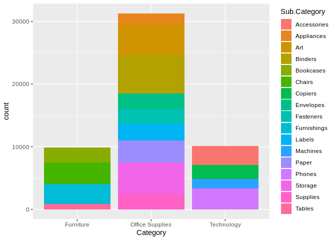
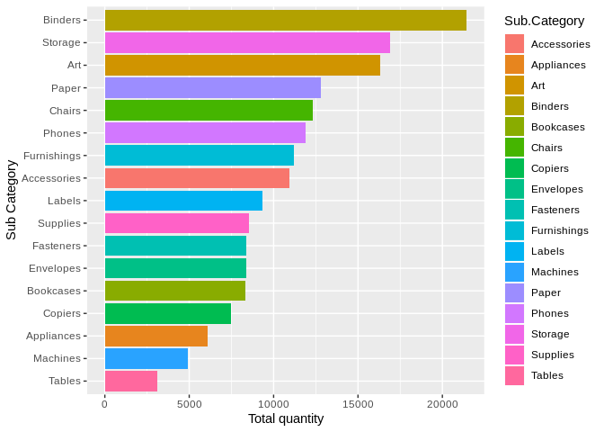
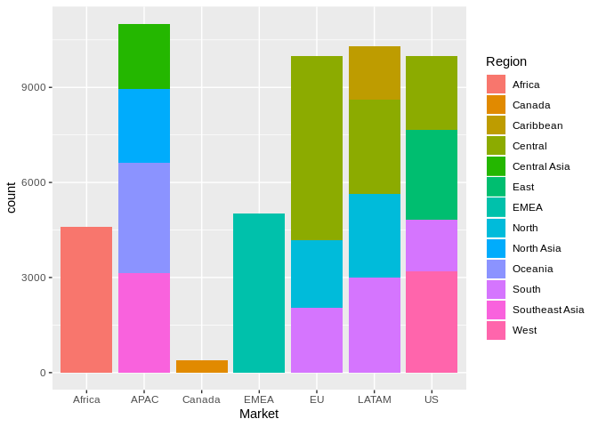
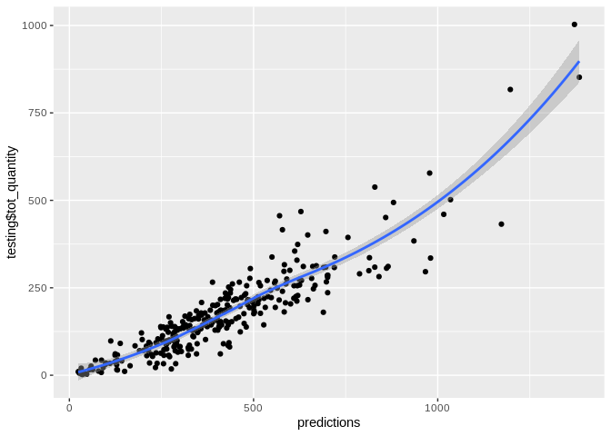

Predicting total quantity of products by Category
================
Gianluca Crocivera
7/6/2019

### Load packages

``` r
library(ggplot2)
library(dplyr)
library(stringr)
library(caret)
```

### Load data

``` r
superstore_dataset2011_2015 <- read.csv("superstore_dataset2011-2015.csv", na.strings = c(NA,"","#DIV/0!"))
```

## Part 1: Data

The data set `superstore_dataset2011_2015` is comprised of 51290
observations di prodotti venduti tra il 2011 e il 2015. We have
observations on 24 different variables, some categorical and some
numerical. The analysis is observational and not experimental and no
random assignment was used, therefore causality relationships cannot be
established between the variables .

## Part 2: Research question

What is the relation between the sub category , market of a product and
his total quantity sold, while keeping the other variables constant?

The variables chosen are:

<ul>

<li>

**tot\_quantity**: total quantity sold of a sub category (predicted
variable)

</li>

<li>

**mean\_sales**: mean sales (predictor variable)

</li>

<li>

**Market**: Africa, APAC, Canada, EMEA, EU, LATAM, US (predictor
variable)

</li>

<li>

**Region**: “Africa”,“Canada”,“Caribbean”, “Central”, “Central Asia”.
“East”, “EMEA”, “North”,“North Asia”,“Oceania”,“South”,“Southeast
Asia”, “West” (predictor variable)

</li>

<li>

**Category**: Furniture, Office Supplies, Technology (predictor
variable)

</li>

<li>

**Sub Category**:
“Binders”,“Storage”,“Art”,“Paper”,“Chairs”,“Phones”,“Furnishings”,“Labels”,“Supplies”,“Envelopes”,“Fasteners”,“Bookcases”,“Copiers”,“Appliances”,“Machines”,“Tables”
(predictor variable)

</li>

</ul>

## Part 3: Exploratory data analysis

``` r
superstore_dataset2011_2015 %>%
  ggplot(aes(Category,fill=Sub.Category)) +
  geom_bar()
```

<!-- -->

``` r
df <-superstore_dataset2011_2015 %>%
       group_by(Sub.Category) %>%
       summarise(tot_quantity = sum(Quantity)) %>%
       arrange(desc(tot_quantity))

df %>%
  ggplot(aes(x=reorder(Sub.Category,tot_quantity),y=tot_quantity, fill=Sub.Category)) +
  geom_bar(stat = "identity")+
  coord_flip() +
  xlab("Sub Category") +
  ylab("Total quantity")
```

<!-- -->

``` r
superstore_dataset2011_2015 %>%
  ggplot(aes(Market,fill=Region)) +
  geom_bar()
```

<!-- -->

The list of Sub Categories sorted by the total quantity sold is
displayed for each Market in the sample:

``` r
for (m in levels(superstore_dataset2011_2015$Market)) {
  print(str_to_upper(m))
  df <-superstore_dataset2011_2015 %>%
       filter(Market==m) %>%
       group_by(Sub.Category) %>%
       summarise(tot_quantity = sum(Quantity)) %>%
       arrange(desc(tot_quantity))
  
  print(df)
  print("___________________________________________________________________")
}
```

    ## [1] "AFRICA"
    ## # A tibble: 17 x 2
    ##    Sub.Category tot_quantity
    ##    <fct>               <int>
    ##  1 Art                  1497
    ##  2 Binders              1443
    ##  3 Storage              1286
    ##  4 Phones                614
    ##  5 Labels                556
    ##  6 Supplies              548
    ##  7 Paper                 532
    ##  8 Fasteners             502
    ##  9 Furnishings           500
    ## 10 Accessories           484
    ## 11 Machines              479
    ## 12 Copiers               454
    ## 13 Chairs                437
    ## 14 Envelopes             425
    ## 15 Bookcases             407
    ## 16 Appliances            313
    ## 17 Tables                 87
    ## [1] "___________________________________________________________________"
    ## [1] "APAC"
    ## # A tibble: 17 x 2
    ##    Sub.Category tot_quantity
    ##    <fct>               <int>
    ##  1 Chairs               3594
    ##  2 Binders              3541
    ##  3 Storage              3061
    ##  4 Labels               2767
    ##  5 Supplies             2694
    ##  6 Phones               2631
    ##  7 Accessories          2620
    ##  8 Paper                2568
    ##  9 Furnishings          2460
    ## 10 Fasteners            2452
    ## 11 Art                  2397
    ## 12 Copiers              2385
    ## 13 Bookcases            2361
    ## 14 Envelopes            2344
    ## 15 Machines             1357
    ## 16 Appliances           1310
    ## 17 Tables                684
    ## [1] "___________________________________________________________________"
    ## [1] "CANADA"
    ## # A tibble: 17 x 2
    ##    Sub.Category tot_quantity
    ##    <fct>               <int>
    ##  1 Binders               132
    ##  2 Art                   129
    ##  3 Storage               118
    ##  4 Paper                  54
    ##  5 Labels                 49
    ##  6 Phones                 46
    ##  7 Accessories            42
    ##  8 Supplies               41
    ##  9 Fasteners              35
    ## 10 Bookcases              32
    ## 11 Appliances             30
    ## 12 Copiers                29
    ## 13 Envelopes              25
    ## 14 Machines               25
    ## 15 Chairs                 24
    ## 16 Furnishings            20
    ## 17 Tables                  2
    ## [1] "___________________________________________________________________"
    ## [1] "EMEA"
    ## # A tibble: 17 x 2
    ##    Sub.Category tot_quantity
    ##    <fct>               <int>
    ##  1 Art                  1590
    ##  2 Binders              1570
    ##  3 Storage              1452
    ##  4 Phones                737
    ##  5 Furnishings           610
    ##  6 Chairs                568
    ##  7 Accessories           565
    ##  8 Fasteners             551
    ##  9 Machines              549
    ## 10 Supplies              546
    ## 11 Labels                511
    ## 12 Bookcases             500
    ## 13 Envelopes             486
    ## 14 Paper                 449
    ## 15 Copiers               408
    ## 16 Appliances            323
    ## 17 Tables                102
    ## [1] "___________________________________________________________________"
    ## [1] "EU"
    ## # A tibble: 17 x 2
    ##    Sub.Category tot_quantity
    ##    <fct>               <int>
    ##  1 Art                  5394
    ##  2 Binders              5058
    ##  3 Storage              4867
    ##  4 Phones               2169
    ##  5 Chairs               1813
    ##  6 Supplies             1787
    ##  7 Bookcases            1785
    ##  8 Accessories          1761
    ##  9 Furnishings          1734
    ## 10 Copiers              1733
    ## 11 Labels               1730
    ## 12 Paper                1664
    ## 13 Envelopes            1599
    ## 14 Fasteners            1597
    ## 15 Machines             1556
    ## 16 Appliances           1187
    ## 17 Tables                339
    ## [1] "___________________________________________________________________"
    ## [1] "LATAM"
    ## # A tibble: 17 x 2
    ##    Sub.Category tot_quantity
    ##    <fct>               <int>
    ##  1 Binders              3711
    ##  2 Chairs               3544
    ##  3 Storage              2975
    ##  4 Envelopes            2595
    ##  5 Accessories          2498
    ##  6 Phones               2384
    ##  7 Paper                2377
    ##  8 Bookcases            2357
    ##  9 Fasteners            2339
    ## 10 Furnishings          2338
    ## 11 Labels               2309
    ## 12 Art                  2294
    ## 13 Supplies             2280
    ## 14 Copiers              2211
    ## 15 Appliances           1186
    ## 16 Tables                628
    ## 17 Machines              500
    ## [1] "___________________________________________________________________"
    ## [1] "US"
    ## # A tibble: 17 x 2
    ##    Sub.Category tot_quantity
    ##    <fct>               <int>
    ##  1 Binders              5974
    ##  2 Paper                5178
    ##  3 Furnishings          3563
    ##  4 Phones               3289
    ##  5 Storage              3158
    ##  6 Art                  3000
    ##  7 Accessories          2976
    ##  8 Chairs               2356
    ##  9 Appliances           1729
    ## 10 Labels               1400
    ## 11 Tables               1241
    ## 12 Fasteners             914
    ## 13 Envelopes             906
    ## 14 Bookcases             868
    ## 15 Supplies              647
    ## 16 Machines              440
    ## 17 Copiers               234
    ## [1] "___________________________________________________________________"

The following data set is then constructed to answer the research
question:

``` r
df <-superstore_dataset2011_2015 %>%
       group_by(Market,Region,Category,Sub.Category) %>%
       summarise(tot_quantity = sum(Quantity),
                 mean_sales=mean(Sales)) %>%
       arrange(desc(tot_quantity))
print(df)
```

    ## # A tibble: 306 x 6
    ## # Groups:   Market, Region, Category [54]
    ##    Market Region  Category        Sub.Category tot_quantity mean_sales
    ##    <fct>  <fct>   <fct>           <fct>               <int>      <dbl>
    ##  1 EU     Central Office Supplies Art                  3217      114. 
    ##  2 EU     Central Office Supplies Binders              3045       78.9
    ##  3 EU     Central Office Supplies Storage              2741      273. 
    ##  4 US     West    Office Supplies Binders              1868      119. 
    ##  5 US     West    Office Supplies Paper                1702       59.3
    ##  6 US     East    Office Supplies Binders              1652      122. 
    ##  7 EMEA   EMEA    Office Supplies Art                  1590       54.8
    ##  8 EMEA   EMEA    Office Supplies Binders              1570       38.4
    ##  9 Africa Africa  Office Supplies Art                  1497       62.1
    ## 10 US     Central Office Supplies Binders              1473      156. 
    ## # … with 296 more rows

## Part 4: Modeling

For model selection I choose backwards elimination of multiple
regression modeling: start with a full model (containing all
predictors), drop one predictor at a time and record adjusted R square
of each smaller model, pick the model with the highest increase in
adjusted R square. Repeat until none of the models yield an increase in
the adjusted R square. R square tells us what percent of variability in
the response variable is explained by the model. Adjusted R square
applies a penalty for the number of predictors included in the model.

``` r
var_ex <- c('Market','Region','Category','Sub.Category','mean_sales')

f <- paste ( 'tot_quantity' ,paste(var_ex, collapse = ' + ' ), sep = '~')
      m <- lm( f , data = df)
      
print("________________________________________________")
```

    ## [1] "________________________________________________"

``` r
print(f)
```

    ## [1] "tot_quantity~Market + Region + Category + Sub.Category + mean_sales"

``` r
print(summary(m)$adj.r.squared)        
```

    ## [1] 0.5507004

``` r
for (i in 1:4) {

  dict <- c()
    
  for (e in var_ex) {
      var_temp <- var_ex[!var_ex==e]
  f <- paste ( 'tot_quantity' ,paste(var_temp, collapse = ' + ' ), sep = '~')
      m <- lm( f , data = df)
      dict[e] <- summary(m)$adj.r.squared
  }
  print("________________________________________________")
  print(dict[which.max(dict)])
  var_ex <-var_ex[!var_ex==names(which.max(dict))]

}
```

    ## [1] "________________________________________________"
    ##  Category 
    ## 0.5507004 
    ## [1] "________________________________________________"
    ## mean_sales 
    ##   0.542296 
    ## [1] "________________________________________________"
    ##    Market 
    ## 0.4917222 
    ## [1] "________________________________________________"
    ##    Region 
    ## 0.3090957

**From the model we need to delete Category to get an adjusted R square=
0.5507004 then adjusted R square starts to decrease. Region and Market
are collinear so the final model is: **

``` r
var_ex <- c('Market','Sub.Category','mean_sales')

f <- paste ( 'tot_quantity' ,paste(var_ex, collapse = ' + ' ), sep = '~')
final_model <- lm( f , data = df)
      
summary(final_model)
```

    ## 
    ## Call:
    ## lm(formula = f, data = df)
    ## 
    ## Residuals:
    ##    Min     1Q Median     3Q    Max 
    ## -612.6 -188.4  -14.9  118.3 2152.4 
    ## 
    ## Coefficients:
    ##                           Estimate Std. Error t value Pr(>|t|)    
    ## (Intercept)              675.88211  106.80146   6.328 9.71e-10 ***
    ## MarketAPAC                15.67208   87.19238   0.180  0.85748    
    ## MarketCanada            -574.31692  109.33445  -5.253 2.96e-07 ***
    ## MarketEMEA                53.06142  109.33784   0.485  0.62784    
    ## MarketEU                 148.76212   89.94316   1.654  0.09925 .  
    ## MarketLATAM              -52.51263   86.43905  -0.608  0.54400    
    ## MarketUS                 -27.09280   87.54606  -0.309  0.75719    
    ## Sub.CategoryAppliances  -199.04387  109.52431  -1.817  0.07022 .  
    ## Sub.CategoryArt          262.39356  107.05207   2.451  0.01485 *  
    ## Sub.CategoryBinders      547.58384  107.03844   5.116 5.78e-07 ***
    ## Sub.CategoryBookcases    -79.00304  109.17617  -0.724  0.46989    
    ## Sub.CategoryChairs       111.78927  107.02776   1.044  0.29715    
    ## Sub.CategoryCopiers      -55.24703  118.13603  -0.468  0.64039    
    ## Sub.CategoryEnvelopes   -177.96542  107.06591  -1.662  0.09758 .  
    ## Sub.CategoryFasteners   -185.17400  107.45986  -1.723  0.08595 .  
    ## Sub.CategoryFurnishings   -9.98311  106.67419  -0.094  0.92551    
    ## Sub.CategoryLabels      -133.97807  107.49245  -1.246  0.21365    
    ## Sub.CategoryMachines    -243.33262  111.65791  -2.179  0.03014 *  
    ## Sub.CategoryPaper         69.33972  107.04193   0.648  0.51765    
    ## Sub.CategoryPhones       105.07527  108.11792   0.972  0.33195    
    ## Sub.CategoryStorage      327.08173  106.26579   3.078  0.00229 ** 
    ## Sub.CategorySupplies    -158.21753  106.64924  -1.484  0.13905    
    ## Sub.CategoryTables      -303.78655  117.22328  -2.592  0.01005 *  
    ## mean_sales                -0.19670    0.07321  -2.687  0.00764 ** 
    ## ---
    ## Signif. codes:  0 '***' 0.001 '**' 0.01 '*' 0.05 '.' 0.1 ' ' 1
    ## 
    ## Residual standard error: 318.8 on 282 degrees of freedom
    ## Multiple R-squared:  0.4757, Adjusted R-squared:  0.433 
    ## F-statistic: 11.13 on 23 and 282 DF,  p-value: < 2.2e-16

## Part 5: Prediction with Multiple Linear Model

``` r
for (m in c("EU","US"))  
  
  for (s in c("Binders","Storage","Art","Paper","Chairs","Phones","Furnishings","Labels","Supplies","Envelopes","Fasteners","Bookcases","Copiers","Appliances","Machines","Tables")) {
      new_product <- data.frame( Market=m, Sub.Category = s, mean_sales=100)
      pred <-predict(final_model, new_product, interval = "confidence", level = 0.95)
      print("______________________________________________________________")
      print(paste("Market :",str_to_upper(m))) 
      print(paste("Sub category: ",str_to_upper(s)))
      print(paste("The predict total quantity is ",round(pred[1],2), "."))
      print("We are 95% confident that total quantity will be") 
      print(paste("between ",round(pred[2],2), " and " , round(pred[3],2) ,"" ))
  }
```

    ## [1] "______________________________________________________________"
    ## [1] "Market : EU"
    ## [1] "Sub category:  BINDERS"
    ## [1] "The predict total quantity is  1352.56 ."
    ## [1] "We are 95% confident that total quantity will be"
    ## [1] "between  1184.29  and  1520.82 "
    ## [1] "______________________________________________________________"
    ## [1] "Market : EU"
    ## [1] "Sub category:  STORAGE"
    ## [1] "The predict total quantity is  1132.06 ."
    ## [1] "We are 95% confident that total quantity will be"
    ## [1] "between  961.95  and  1302.16 "
    ## [1] "______________________________________________________________"
    ## [1] "Market : EU"
    ## [1] "Sub category:  ART"
    ## [1] "The predict total quantity is  1067.37 ."
    ## [1] "We are 95% confident that total quantity will be"
    ## [1] "between  899.11  and  1235.63 "
    ## [1] "______________________________________________________________"
    ## [1] "Market : EU"
    ## [1] "Sub category:  PAPER"
    ## [1] "The predict total quantity is  874.31 ."
    ## [1] "We are 95% confident that total quantity will be"
    ## [1] "between  706.05  and  1042.58 "
    ## [1] "______________________________________________________________"
    ## [1] "Market : EU"
    ## [1] "Sub category:  CHAIRS"
    ## [1] "The predict total quantity is  916.76 ."
    ## [1] "We are 95% confident that total quantity will be"
    ## [1] "between  740.12  and  1093.41 "
    ## [1] "______________________________________________________________"
    ## [1] "Market : EU"
    ## [1] "Sub category:  PHONES"
    ## [1] "The predict total quantity is  910.05 ."
    ## [1] "We are 95% confident that total quantity will be"
    ## [1] "between  728.63  and  1091.47 "
    ## [1] "______________________________________________________________"
    ## [1] "Market : EU"
    ## [1] "Sub category:  FURNISHINGS"
    ## [1] "The predict total quantity is  794.99 ."
    ## [1] "We are 95% confident that total quantity will be"
    ## [1] "between  626.46  and  963.52 "
    ## [1] "______________________________________________________________"
    ## [1] "Market : EU"
    ## [1] "Sub category:  LABELS"
    ## [1] "The predict total quantity is  671 ."
    ## [1] "We are 95% confident that total quantity will be"
    ## [1] "between  502.72  and  839.27 "
    ## [1] "______________________________________________________________"
    ## [1] "Market : EU"
    ## [1] "Sub category:  SUPPLIES"
    ## [1] "The predict total quantity is  646.76 ."
    ## [1] "We are 95% confident that total quantity will be"
    ## [1] "between  478.2  and  815.32 "
    ## [1] "______________________________________________________________"
    ## [1] "Market : EU"
    ## [1] "Sub category:  ENVELOPES"
    ## [1] "The predict total quantity is  627.01 ."
    ## [1] "We are 95% confident that total quantity will be"
    ## [1] "between  458.75  and  795.27 "
    ## [1] "______________________________________________________________"
    ## [1] "Market : EU"
    ## [1] "Sub category:  FASTENERS"
    ## [1] "The predict total quantity is  619.8 ."
    ## [1] "We are 95% confident that total quantity will be"
    ## [1] "between  451.53  and  788.07 "
    ## [1] "______________________________________________________________"
    ## [1] "Market : EU"
    ## [1] "Sub category:  BOOKCASES"
    ## [1] "The predict total quantity is  725.97 ."
    ## [1] "We are 95% confident that total quantity will be"
    ## [1] "between  540.56  and  911.38 "
    ## [1] "______________________________________________________________"
    ## [1] "Market : EU"
    ## [1] "Sub category:  COPIERS"
    ## [1] "The predict total quantity is  749.73 ."
    ## [1] "We are 95% confident that total quantity will be"
    ## [1] "between  537.01  and  962.44 "
    ## [1] "______________________________________________________________"
    ## [1] "Market : EU"
    ## [1] "Sub category:  APPLIANCES"
    ## [1] "The predict total quantity is  605.93 ."
    ## [1] "We are 95% confident that total quantity will be"
    ## [1] "between  419.28  and  792.58 "
    ## [1] "______________________________________________________________"
    ## [1] "Market : EU"
    ## [1] "Sub category:  MACHINES"
    ## [1] "The predict total quantity is  561.64 ."
    ## [1] "We are 95% confident that total quantity will be"
    ## [1] "between  367.9  and  755.38 "
    ## [1] "______________________________________________________________"
    ## [1] "Market : EU"
    ## [1] "Sub category:  TABLES"
    ## [1] "The predict total quantity is  501.19 ."
    ## [1] "We are 95% confident that total quantity will be"
    ## [1] "between  291  and  711.37 "
    ## [1] "______________________________________________________________"
    ## [1] "Market : US"
    ## [1] "Sub category:  BINDERS"
    ## [1] "The predict total quantity is  1176.7 ."
    ## [1] "We are 95% confident that total quantity will be"
    ## [1] "between  1014.07  and  1339.34 "
    ## [1] "______________________________________________________________"
    ## [1] "Market : US"
    ## [1] "Sub category:  STORAGE"
    ## [1] "The predict total quantity is  956.2 ."
    ## [1] "We are 95% confident that total quantity will be"
    ## [1] "between  790.89  and  1121.51 "
    ## [1] "______________________________________________________________"
    ## [1] "Market : US"
    ## [1] "Sub category:  ART"
    ## [1] "The predict total quantity is  891.51 ."
    ## [1] "We are 95% confident that total quantity will be"
    ## [1] "between  728.89  and  1054.14 "
    ## [1] "______________________________________________________________"
    ## [1] "Market : US"
    ## [1] "Sub category:  PAPER"
    ## [1] "The predict total quantity is  698.46 ."
    ## [1] "We are 95% confident that total quantity will be"
    ## [1] "between  535.82  and  861.09 "
    ## [1] "______________________________________________________________"
    ## [1] "Market : US"
    ## [1] "Sub category:  CHAIRS"
    ## [1] "The predict total quantity is  740.91 ."
    ## [1] "We are 95% confident that total quantity will be"
    ## [1] "between  567.92  and  913.9 "
    ## [1] "______________________________________________________________"
    ## [1] "Market : US"
    ## [1] "Sub category:  PHONES"
    ## [1] "The predict total quantity is  734.19 ."
    ## [1] "We are 95% confident that total quantity will be"
    ## [1] "between  555.88  and  912.51 "
    ## [1] "______________________________________________________________"
    ## [1] "Market : US"
    ## [1] "Sub category:  FURNISHINGS"
    ## [1] "The predict total quantity is  619.14 ."
    ## [1] "We are 95% confident that total quantity will be"
    ## [1] "between  455.99  and  782.28 "
    ## [1] "______________________________________________________________"
    ## [1] "Market : US"
    ## [1] "Sub category:  LABELS"
    ## [1] "The predict total quantity is  495.14 ."
    ## [1] "We are 95% confident that total quantity will be"
    ## [1] "between  332.72  and  657.56 "
    ## [1] "______________________________________________________________"
    ## [1] "Market : US"
    ## [1] "Sub category:  SUPPLIES"
    ## [1] "The predict total quantity is  470.9 ."
    ## [1] "We are 95% confident that total quantity will be"
    ## [1] "between  307.7  and  634.1 "
    ## [1] "______________________________________________________________"
    ## [1] "Market : US"
    ## [1] "Sub category:  ENVELOPES"
    ## [1] "The predict total quantity is  451.15 ."
    ## [1] "We are 95% confident that total quantity will be"
    ## [1] "between  288.54  and  613.77 "
    ## [1] "______________________________________________________________"
    ## [1] "Market : US"
    ## [1] "Sub category:  FASTENERS"
    ## [1] "The predict total quantity is  443.95 ."
    ## [1] "We are 95% confident that total quantity will be"
    ## [1] "between  281.52  and  606.37 "
    ## [1] "______________________________________________________________"
    ## [1] "Market : US"
    ## [1] "Sub category:  BOOKCASES"
    ## [1] "The predict total quantity is  550.12 ."
    ## [1] "We are 95% confident that total quantity will be"
    ## [1] "between  367.43  and  732.8 "
    ## [1] "______________________________________________________________"
    ## [1] "Market : US"
    ## [1] "Sub category:  COPIERS"
    ## [1] "The predict total quantity is  573.87 ."
    ## [1] "We are 95% confident that total quantity will be"
    ## [1] "between  362.1  and  785.64 "
    ## [1] "______________________________________________________________"
    ## [1] "Market : US"
    ## [1] "Sub category:  APPLIANCES"
    ## [1] "The predict total quantity is  430.08 ."
    ## [1] "We are 95% confident that total quantity will be"
    ## [1] "between  246.04  and  614.11 "
    ## [1] "______________________________________________________________"
    ## [1] "Market : US"
    ## [1] "Sub category:  MACHINES"
    ## [1] "The predict total quantity is  385.79 ."
    ## [1] "We are 95% confident that total quantity will be"
    ## [1] "between  194.1  and  577.47 "
    ## [1] "______________________________________________________________"
    ## [1] "Market : US"
    ## [1] "Sub category:  TABLES"
    ## [1] "The predict total quantity is  325.33 ."
    ## [1] "We are 95% confident that total quantity will be"
    ## [1] "between  116.22  and  534.44 "

## Part 6: Prediction with Machine Learning (Random Forest)

``` r
inTrain <- createDataPartition(y=superstore_dataset2011_2015$Quantity, p=0.7,list = FALSE)
training <- superstore_dataset2011_2015[inTrain,]
testing <- superstore_dataset2011_2015[-inTrain,]
training <- training %>%
       group_by(Market,Region,Sub.Category) %>%
       summarise(tot_quantity = sum(Quantity), mean_price=mean(Sales)) %>%
       arrange(desc(tot_quantity))

testing <- testing %>%
       group_by(Market,Region,Sub.Category) %>%
       summarise(tot_quantity = sum(Quantity), mean_price=mean(Sales)) %>%
       arrange(desc(tot_quantity))
```

``` r
set.seed(1234)
modelFit <- train(tot_quantity ~ ., data = training, method="rf", verbose=FALSE)
modelFit
```

    ## Random Forest 
    ## 
    ## 305 samples
    ##   4 predictor
    ## 
    ## No pre-processing
    ## Resampling: Bootstrapped (25 reps) 
    ## Summary of sample sizes: 305, 305, 305, 305, 305, 305, ... 
    ## Resampling results across tuning parameters:
    ## 
    ##   mtry  RMSE      Rsquared   MAE     
    ##    2    232.9653  0.5035022  158.8301
    ##   18    220.2165  0.4585675  136.1262
    ##   35    235.5385  0.4063082  142.5527
    ## 
    ## RMSE was used to select the optimal model using the smallest value.
    ## The final value used for the model was mtry = 18.

``` r
predictions <- predict(modelFit, newdata = testing)

ggplot(mapping=aes(predictions,testing$tot_quantity)) +
  geom_point() +
  geom_smooth(method = "auto")
```

    ## `geom_smooth()` using method = 'loess' and formula 'y ~ x'

<!-- -->
