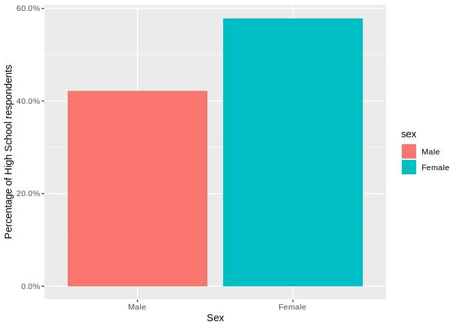

Statistical inference with the GSS data
================
Gianluca Crocivera
7/6/2019

## Setup

### Load packages

``` r
library(ggplot2)
library(dplyr)
library(statsr)
library(scales)
```

### Load data

``` r
load("gss.Rdata")
```

-----

## Part 1: Data

The General Social Surveys have been conducted in the following years
alongside the total number of interviews to English-speaking persons 18
years of age or over, living in non-institutional arrangements within
the United States:

``` r
n<-gss %>%
  filter(!is.na(year)) %>%
  group_by(year) %>%
  summarise(total_interviews=n())
options(max.print = 100)
print.data.frame(n)
```

    ##    year total_interviews
    ## 1  1972             1613
    ## 2  1973             1504
    ## 3  1974             1484
    ## 4  1975             1490
    ## 5  1976             1499
    ## 6  1977             1530
    ## 7  1978             1532
    ## 8  1980             1468
    ## 9  1982             1860
    ## 10 1983             1599
    ## 11 1984             1473
    ## 12 1985             1534
    ## 13 1986             1470
    ## 14 1987             1819
    ## 15 1988             1481
    ## 16 1989             1537
    ## 17 1990             1372
    ## 18 1991             1517
    ## 19 1993             1606
    ## 20 1994             2992
    ## 21 1996             2904
    ## 22 1998             2832
    ## 23 2000             2817
    ## 24 2002             2765
    ## 25 2004             2812
    ## 26 2006             4510
    ## 27 2008             2023
    ## 28 2010             2044
    ## 29 2012             1974

The total of all completed interviews are :

``` r
nrow(gss)
```

    ## [1] 57061

The median length of the interview has been about one and a half hours.
Each survey from 1972 to 2004 was an independently drawn sample.
Starting in 2006 Spanish-speakers were added to the target population.  
The interviews in the sample are independent (simple random sample
consists of 57061 observations, fewer than 10% of the USs population) so
the results can be generalized to the US population. We have interviews
on 114 different variables, some categorical and some numerical.

``` r
ncol(gss)
```

    ## [1] 114

The analysis is observational and not experimental and no random
assignment was used, therefore causality relationships cannot be
established between the variables .

-----

## Part 2: Research question

Is it true that the family income of US women is lower than that of men
in the aforementioned years in which the data of this data set were
collected? Is it true that proportions of US women who have ‘Lt High
School’,‘High School’,‘Junior College’,‘Bachelor’ is more than men in
the aforementioned years in which the data of this data set were
collected? Is it true that proportion of US women who have ‘Graduate’ is
less than men in the aforementioned years in which the data of this data
set were collected?

The variables are :

<ul>

<li>

**coninc**: family income in constant dollars (numerical variable)

</li>

<li>

**sex**:sex of respondent (categorical variable with value : Female and
Male)

</li>

<li>

**degree**: Respondent highest degree (categorical variable with value :
Lt High School,High School,Junior College,Bachelor,Graduate)

</li>

</ul>

## Part 3: Exploratory data analysis

We will first start with analyzing total family income in constant
dollars: `coninc`.

Using visualization and summary statistics, describe the distribution of
total family income in constant dollars.

``` r
summary(gss$coninc)
```

    ##    Min. 1st Qu.  Median    Mean 3rd Qu.    Max.    NA's 
    ##     383   18445   35602   44503   59542  180386    5829

``` r
gss %>% filter(!is.na(coninc)) %>% summarise(total_respondents =n())
```

    ##   total_respondents
    ## 1             51232

Next consider histogram :

``` r
gss %>% 
  filter(!is.na(coninc)) %>%
  ggplot(aes(coninc)) +
  geom_histogram(col='red',binwidth = 5000)+
  xlab("Family income in costant dollars") +
  ylab("Total number of respondents")
```

<!-- -->

5829 respondents did not provide their family income in dollars. The
distribution is right skewed with an average of 44503 dollars and a
median of 35602 dollars but the size of the random sample is very large,
so we can relax the nearly normal requirement .

Next, we consider the categorical variable `sex`

``` r
prop.table(table(gss$sex))*100
```

    ## 
    ##     Male   Female 
    ## 44.06863 55.93137

``` r
gss %>% 
  filter(!is.na(sex)) %>% 
  ggplot(aes(sex,fill=sex)) + 
  geom_bar(aes(y=(..count../sum(..count..))))+
  scale_y_continuous(labels = percent_format())+
  ylab("Percent of respondents") +
  xlab("Sex") 
```

<!-- -->

In the sample the percentage of women interviewed is greater than men.

Next, we consider the respondents’s possible relationship between total
family income in constant dollars and sex.

``` r
gss %>% 
  filter(!is.na(coninc),!is.na(sex)) %>%
  group_by(sex) %>%
  summarize(
    mean(coninc),
    median(coninc),
    sd(coninc),
    range=range(coninc)[2]-range(coninc)[1],
    IQR(coninc))
```

    ## # A tibble: 2 x 6
    ##   sex    `mean(coninc)` `median(coninc)` `sd(coninc)`  range `IQR(coninc)`
    ##   <fct>           <dbl>            <int>        <dbl>  <int>         <dbl>
    ## 1 Male           48764.            39695       36916. 180003         41614
    ## 2 Female         41020.            32143       34729. 180003         38596

``` r
gss %>% filter(!is.na(coninc),!is.na(sex)) %>% 
  ggplot(aes(coninc,fill=sex)) +
  geom_histogram (bins=30,color='black')+
  xlab("Family income in costant dollars") +
  ylab("Total number of respondents") +
  ggtitle("Family income of the respondent based on gender") +
  scale_fill_discrete(name="Sex")
```

<!-- -->

``` r
gss %>% 
  filter(!is.na(sex),!is.na(coninc)) %>% 
  ggplot(aes(sex,coninc)) + 
  geom_boxplot()+
  ylab("Family income in costant dollars") +
  xlab("Sex") 
```

<!-- -->

Both distributions are right skewed with outliers. The median of men is
greater than that of women, as seen from boxplots and the summarization.
The range is the same, while IQR is greater for men

For the mean is there a difference statistically significant? I will
conduct a hypothesis test in order to answer this question.

The plots that give the percentage of Graduate and High School
respondents in based on gender are the following:

``` r
gss %>% 
  filter(!is.na(sex),degree=='Graduate') %>% 
  ggplot(aes(sex,fill=sex)) + 
  geom_bar(aes(y=(..count../sum(..count..))))+
  scale_y_continuous(labels = percent_format())+
  ylab("Percentage of Graduate respondents") +
  xlab("Sex") 
```

<!-- -->

``` r
gss %>% 
  filter(!is.na(sex),degree=='High School') %>% 
  ggplot(aes(sex,fill=sex)) + 
  geom_bar(aes(y=(..count../sum(..count..))))+
  scale_y_continuous(labels = percent_format())+
  ylab("Percentage of High School respondents") +
  xlab("Sex") 
```

<!-- -->

As can be seen from the barplot in the sample, the percentage of women
with high school is greater than that of men, whereas the percentage of
women who have graduate is less than that of men. But is this generally
true for US women in the years in which the survey was done?

In order to answer this question I will find the confidence intervals.

-----

## Part 4: Inference

The hypotheses for testing if the average family income of US men is
greater than women is :

H0: mu\_Male = mu\_Female

HA: mu\_Male \> mu\_Female

Each observation in group male does not have a special correspondence
with exactly one observation in the group female, then data are not
paired and independent.We work with a random sample of observations
which are less than 10% of a large data set of all possible US in years
of survey, so the observations in each group are independent.The samples
size are 25146 for male and 31915 for female then the sample sizes are
very large. We can relax the nearly normal requirement and we can use
the t\_distribution,while each distribution is strongly skewed.

``` r
gss %>% filter(!is.na(sex)) %>% group_by(sex)  %>%summarize(n())
```

    ## # A tibble: 2 x 2
    ##   sex    `n()`
    ##   <fct>  <int>
    ## 1 Male   25146
    ## 2 Female 31915

``` r
g<- gss %>%
  filter(!is.na(sex),!is.na(coninc))

inference(y = coninc, x = sex, data = g, statistic = "mean", type = "ht", null=0,
          alternative = "greater", method = "theoretical")
```

    ## Response variable: numerical
    ## Explanatory variable: categorical (2 levels) 
    ## n_Male = 23043, y_bar_Male = 48763.6453, s_Male = 36916.3394
    ## n_Female = 28189, y_bar_Female = 41020.2199, s_Female = 34728.8358
    ## H0: mu_Male =  mu_Female
    ## HA: mu_Male > mu_Female
    ## t = 24.2541, df = 23042
    ## p_value = < 0.0001

<!-- -->

**We reject H0. p\_value \<0.05 . The data provide strong evidence that
the family income declared by US men is greater than that declared by US
women.**

``` r
inference(y = coninc, x = sex, data = g, statistic = "mean", type = "ci", null=0,
          alternative = "greater", method = "theoretical")
```

    ## Response variable: numerical, Explanatory variable: categorical (2 levels)
    ## n_Male = 23043, y_bar_Male = 48763.6453, s_Male = 36916.3394
    ## n_Female = 28189, y_bar_Female = 41020.2199, s_Female = 34728.8358
    ## 95% CI (Male - Female): (7117.6505 , 8369.2002)

<!-- -->

**We are 95% confident that the family income declared by US men is
between 7177 and 8369 dollars more than that declared by women.**

Now let’s evaluate if there is an association between the level of study
and sex through CHI SQUARE test of independence.

The conditions necessary for performing CHI SQUARE test are :
Independence: The samples are both random,unrelated, and from less than
10% of the population, so independence between observations is
reasonable. Sample size: All expected counts are at least 5.

``` r
g<- gss %>%
  filter(!is.na(sex),!is.na(degree))

inference(y = sex, x = degree, data = g, statistic = "proportion", type = "ht", 
          alternative = "greater", method = "theoretical")
```

    ## Response variable: categorical (2 levels) 
    ## Explanatory variable: categorical (5 levels) 
    ## Observed:
    ##                 y
    ## x                 Male Female
    ##   Lt High School  5153   6669
    ##   High School    12340  16947
    ##   Junior College  1272   1798
    ##   Bachelor        3822   4180
    ##   Graduate        2091   1779
    ## 
    ## Expected:
    ##                 y
    ## x                     Male    Female
    ##   Lt High School  5204.962  6617.038
    ##   High School    12894.410 16392.590
    ##   Junior College  1351.652  1718.348
    ##   Bachelor        3523.101  4478.899
    ##   Graduate        1703.874  2166.126
    ## 
    ## H0: degree and sex are independent
    ## HA: degree and sex are dependent
    ## chi_sq = 254.3489, df = 4, p_value = 0

<!-- -->

**Since p-value = 0 \< 0.05,we reject H0 . There is strong evidence that
there is an association between degree and sex.**

Now let us consider whether the proportion of US women with Graduate is
less than the proportion of US men. The success-failure condition is
indeed satisfied np\> = 10 and n (1-p)\> = 10.We dont know proportion p
of US women with Graduate, so use the sample proportion of women with
Graduate.

``` r
g<- gss %>%
  filter(!is.na(sex),degree=='Graduate')

g %>% summarise(p=mean(sex=='Female'),n=sum(degree=='Graduate'),n*p,n*(1-p))
```

    ##           p    n n * p n * (1 - p)
    ## 1 0.4596899 3870  1779        2091

``` r
inference(y = sex, data = g, statistic = "proportion", type = "ci", 
           method = "theoretical",success = 'Female')
```

    ## Single categorical variable, success: Female
    ## n = 3870, p-hat = 0.4597
    ## 95% CI: (0.444 , 0.4754)

<!-- -->

**So we are 95% confident that the percentage of US women who have a
graduate is between 44.4% and 47.5%, that is in any case less than 50%,
so US women with a Graduate are less than men at 95% confidence level.**

We now consider whether the proportions of US women with Lt High School,
High School, Junior College, Bachelor is greater than the proportion of
US men. The success-failure condition is indeed satisfied np\>= 10 and
n(1-p)\>= 10. We dont know proportion p of US women, so use the sample
proportion of women with other
qualifications.

``` r
for (deg in c('Lt High School','High School','Junior College','Bachelor')) {

  g<- gss %>%
  filter(!is.na(sex),degree==deg) %>%
    summarise(deg,n=sum(degree==deg),p=mean(sex=='Female'),n*p,n*(1-p))

  print(g)
  
    
}
```

    ##              deg     n         p n * p n * (1 - p)
    ## 1 Lt High School 11822 0.5641177  6669        5153
    ##           deg     n         p n * p n * (1 - p)
    ## 1 High School 29287 0.5786526 16947       12340
    ##              deg    n         p n * p n * (1 - p)
    ## 1 Junior College 3070 0.5856678  1798        1272
    ##        deg    n         p n * p n * (1 - p)
    ## 1 Bachelor 8002 0.5223694  4180        3822

``` r
for (deg in c('Lt High School','High School','Junior College','Bachelor')) {

  print(deg)
  
  g<- gss %>%
  filter(!is.na(sex),degree==deg)

 inference(y = sex, data = g, statistic = "proportion", type = "ci", 
         method = "theoretical",success = 'Female')

    
}
```

    ## [1] "Lt High School"
    ## Single categorical variable, success: Female
    ## n = 11822, p-hat = 0.5641
    ## 95% CI: (0.5552 , 0.5731)

<!-- -->

    ## [1] "High School"
    ## Single categorical variable, success: Female
    ## n = 29287, p-hat = 0.5787
    ## 95% CI: (0.573 , 0.5843)

<!-- -->

    ## [1] "Junior College"
    ## Single categorical variable, success: Female
    ## n = 3070, p-hat = 0.5857
    ## 95% CI: (0.5682 , 0.6031)

<!-- -->

    ## [1] "Bachelor"
    ## Single categorical variable, success: Female
    ## n = 8002, p-hat = 0.5224
    ## 95% CI: (0.5114 , 0.5333)

<!-- -->

**Instead we are 95% confident that the percentage of US women who have
a ‘Lt High School’,‘High School’,‘Junior College’,‘Bachelor’ is always
more than 50% compared to men, so US women with these qualifications are
always more than men at 95% confidence level.**
